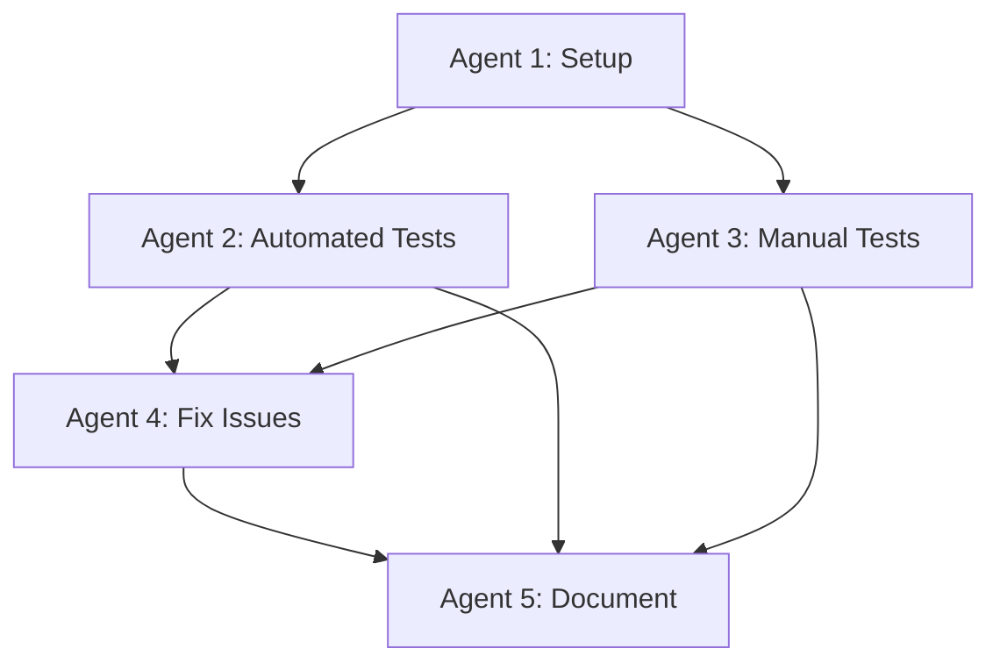

# Agent Coordination - Autonomous Testing Session

**Session ID:** `autonomous-20251122-054459`
**Last Updated:** 2025-11-22 05:44:59 UTC

---

## Agent Status Dashboard

### Agent 1: Test Orchestrator (PRIMARY)
- **Status:** ACTIVE ✅
- **Current Task:** Setting up autonomous testing environment
- **Progress:** Environment setup (30%)
- **Token Usage:** ~60,000 tokens
- **Serena Sync:** Next at 06:00:00
- **Blockers:** None
- **Next Action:** Install test dependencies, start dev server

### Agent 2: Automated Tester
- **Status:** STANDBY ⏸️
- **Current Task:** Awaiting environment setup completion
- **Progress:** 0%
- **Token Usage:** 0 tokens
- **Blockers:** Waiting for:
  - Dev server to start
  - Test suite generation
  - Puppeteer installation
- **Next Action:** Generate and execute automated test suite

### Agent 3: Manual Tester
- **Status:** STANDBY ⏸️
- **Current Task:** Awaiting server startup
- **Progress:** 0%
- **Token Usage:** 0 tokens
- **Blockers:** Waiting for dev server
- **Next Action:** Begin interactive testing of public pages

### Agent 4: Debugger & Fixer
- **Status:** STANDBY ⏸️
- **Current Task:** Awaiting issue reports
- **Progress:** 0%
- **Token Usage:** 0 tokens
- **Blockers:** Waiting for test results
- **Next Action:** Fix critical and high-priority issues

### Agent 5: Documentation Manager
- **Status:** ACTIVE ✅
- **Current Task:** Documentation structure creation
- **Progress:** 60%
- **Token Usage:** ~1,000 tokens
- **Blockers:** None
- **Next Action:** Set up auto-update system

---

## Inter-Agent Messages

**Message Log:**

```
[05:44:59] Agent 1 → All: Session initialized, documentation created
[05:45:30] Agent 1 → All: Serena MCP activated, project context loaded
[05:46:00] Agent 5 → Agent 1: Documentation structure created
[05:46:30] Agent 1 → Agent 2,3: Preparing to start dev server
```

---

## Task Dependencies



---

## Communication Protocol

**High-Priority Issues (Critical/High):**
- Agent 3 or 2 finds issue → Immediately log to TEST-RESULTS.md
- Agent 1 assigns to Agent 4
- Agent 4 fixes and reports back
- Agent 3 or 2 re-tests
- Agent 5 documents

**Medium/Low Priority Issues:**
- Document in TEST-RESULTS.md
- Batch process at end of session

**Coordination:**
- All agents update this file every 15 minutes
- Agent 1 orchestrates and manages token budget
- Agent 5 keeps all documentation synchronized

---

**Next Coordination Sync:** 06:00:00 UTC
