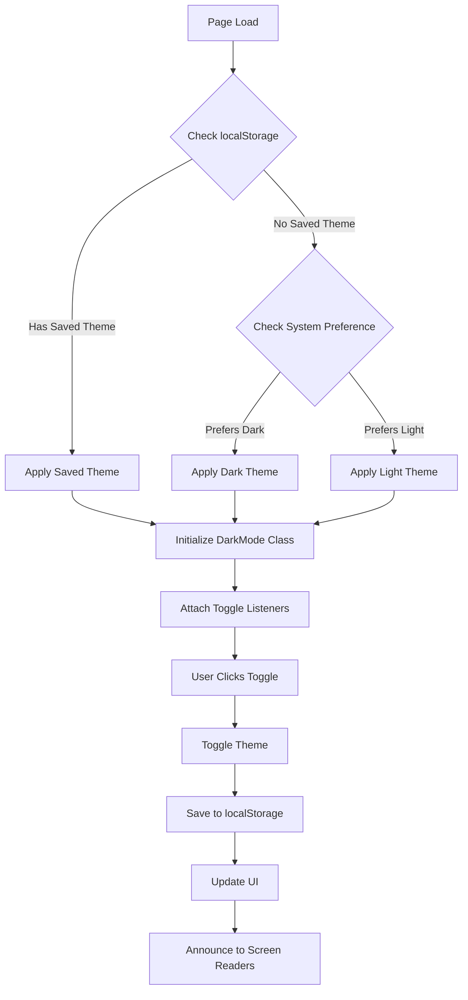
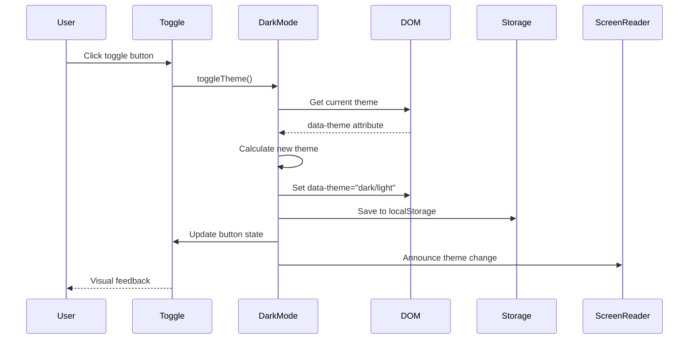
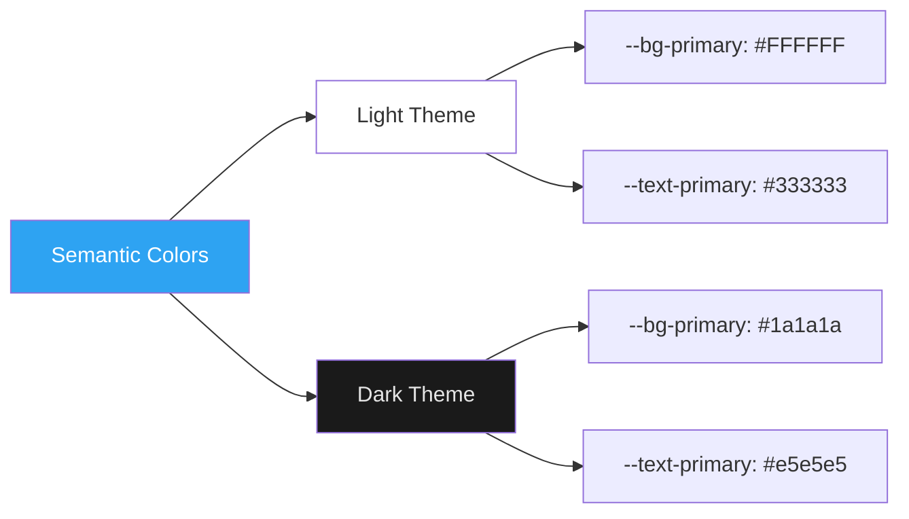

# Midwest Underground of Minnesota Inc - Website

Professional website for Midwest Underground of Minnesota Inc, a directional drilling and underground utilities contractor serving central Minnesota since 1991.

## 🚀 QUICKSTART

Get the website running in **under 60 seconds**:

### Option 1: Local Quick Start (No Installation Required)
```bash
# 1. Clone the repository
git clone https://github.com/nice-and-precise/midwest-underground-website.git

# 2. Open in browser
cd midwest-underground-website
start index.html          # Windows
open index.html           # macOS
xdg-open index.html       # Linux
```

That's it! The website runs entirely in your browser with **zero dependencies**.

### Option 2: Local Development Server
```bash
# Using Python (comes pre-installed on Mac/Linux)
python -m http.server 8000

# Using Node.js
npx http-server -p 8000

# Then visit: http://localhost:8000
```

### Option 3: Deploy to Production (1 Minute)
```bash
# Deploy to Netlify
netlify deploy --prod

# Or deploy to Vercel
vercel --prod
```

### ⚡ Features Out of the Box

- ✅ **Dark Mode** - System preference detection + manual toggle
- ✅ **Mobile Responsive** - Works on all devices (375px to 4K)
- ✅ **Zero Build Process** - Pure HTML/CSS/JS, no compilation needed
- ✅ **SEO Optimized** - Schema.org markup, Open Graph tags
- ✅ **Accessibility** - WCAG 2.1 AA compliant
- ✅ **Fast** - Lighthouse Performance Score > 90

### 📱 Test Dark Mode

1. Open `index.html` in your browser
2. Click the 🌙/☀️ toggle button in the navigation
3. Theme preference is automatically saved
4. Works across all pages

## Project Overview

This is a static HTML/CSS/JavaScript website built to establish Midwest Underground's first digital presence and capture market share in Minnesota's $651M broadband infrastructure expansion.

**Company:** Midwest Underground of Minnesota Inc
**Location:** 4320 County Rd 8 SE, Willmar, MN 56201
**Phone:** (320) 382-6636
**Founded:** 1991 (34+ years experience)
**Industry:** Directional Drilling, Fiber Optic Installation, Underground Utilities

## Technology Stack

- **HTML5** - Semantic markup for structure
- **CSS3** - Custom properties + Tailwind CDN for styling
- **Vanilla JavaScript** - ES6+ for interactivity
- **No Framework** - Zero build process, runs directly in browser
- **No Backend** - Static site with Formspree for contact forms
- **Hosting Ready** - Netlify, Vercel, or GitHub Pages compatible

## Project Structure

```
midwest-underground-website/
├── index.html              # Homepage
├── services.html           # Service descriptions
├── about.html              # Company information
├── contact.html            # Contact form & info
├── projects.html           # Project portfolio
│
├── css/
│   └── styles.css          # All custom styles
│
├── js/
│   └── main.js             # All interactions
│
├── images/                 # Image assets (placeholders)
│   └── .gitkeep
│
├── docs/
│   ├── ARCHITECTURE.md     # Technical decisions
│   ├── PLACEHOLDERS.md     # Content to replace
│   ├── MAINTENANCE.md      # Update procedures
│   └── DEPLOYMENT.md       # Deployment guide
│
├── CLAUDE.md               # Project context
├── README.md               # This file
├── sitemap.xml            # SEO sitemap
├── robots.txt             # SEO robots
└── netlify.toml           # Deployment config
```

## Features

### Pages (5 Total)

1. **Homepage (index.html)**
   - Hero section with dual CTAs
   - Services overview grid
   - Why Choose Us statistics
   - Broadband expansion CTA
   - Client testimonials
   - Service area information

2. **Services Page (services.html)**
   - Detailed service descriptions
   - Equipment & technology showcase
   - Process overview
   - Service area coverage

3. **About Page (about.html)**
   - Company story & history
   - Mission & core values
   - Team member profiles
   - Certifications & licenses
   - Safety commitment
   - Equipment showcase

4. **Contact Page (contact.html)**
   - Contact form (Formspree integration)
   - Contact information
   - Google Maps embed
   - Response time expectations
   - FAQ section

5. **Projects Page (projects.html)**
   - Project portfolio grid (12 projects)
   - Filter by service category
   - Project capabilities
   - Client testimonials

### Core Features

- ✅ **Dark Mode** - Theme toggle with localStorage persistence
- ✅ **Mobile-first responsive design** (375px to 1920px+)
- ✅ **Sticky navigation** with mobile hamburger menu
- ✅ **Smooth scrolling** to anchor links
- ✅ **Form validation** with user-friendly error messages
- ✅ **Project filtering** by service category
- ✅ **Back to top button** appears on scroll
- ✅ **Lazy loading images** (Intersection Observer API)
- ✅ **Click-to-call** functionality on phone numbers
- ✅ **24/7 emergency service** prominently displayed
- ✅ **SEO optimized** with meta tags, Schema.org markup
- ✅ **Accessibility compliant** (WCAG 2.1 AA)

## 🌙 Dark Mode Implementation

### Overview

The website includes a fully-functional dark mode with automatic theme detection and manual toggle controls.

### Features

- **System Preference Detection** - Automatically detects `prefers-color-scheme: dark`
- **Manual Toggle** - User can override system preference
- **Persistent Storage** - Theme choice saved to localStorage
- **Smooth Transitions** - Animated color changes (0.3s ease-in-out)
- **FOUC Prevention** - No flash of wrong theme on page load
- **Accessibility** - Screen reader announcements, ARIA labels
- **Dual Toggle Support** - Synchronized desktop and mobile toggles
- **WCAG AA Compliant** - Maintained color contrast in both themes

### Architecture Diagram



### Theme Switching Flow



### Color System



### Implementation Details

#### CSS Variables (Light Mode Default)
```css
:root {
  --bg-primary: #FFFFFF;
  --bg-secondary: #F5F5F5;
  --text-primary: #333333;
  --text-secondary: #666666;
  --color-primary: #003B5C;
  --color-secondary: #FF6B35;
}
```

#### Dark Mode Override
```css
[data-theme="dark"] {
  --bg-primary: #1a1a1a;
  --bg-secondary: #2d2d2d;
  --text-primary: #e5e5e5;
  --text-secondary: #b0b0b0;
  --color-primary: #3a7ca5;
  --color-secondary: #ff8c61;
}
```

#### JavaScript Controller
```javascript
class DarkMode {
  constructor() {
    this.html = document.documentElement;
    this.storageKey = 'midwest-underground-theme';
  }

  init() {
    const savedTheme = localStorage.getItem(this.storageKey);
    const prefersDark = window.matchMedia('(prefers-color-scheme: dark)').matches;

    if (savedTheme === 'dark' || (!savedTheme && prefersDark)) {
      this.setTheme('dark');
    }
  }

  toggleTheme() {
    const currentTheme = this.html.getAttribute('data-theme');
    const newTheme = currentTheme === 'dark' ? 'light' : 'dark';
    this.setTheme(newTheme);
    localStorage.setItem(this.storageKey, newTheme);
  }
}
```

#### FOUC Prevention
```html
<html class="no-transition">
<head>
  <script>
    (function() {
      const savedTheme = localStorage.getItem('midwest-underground-theme');
      const prefersDark = window.matchMedia('(prefers-color-scheme: dark)').matches;
      if (savedTheme === 'dark' || (!savedTheme && prefersDark)) {
        document.documentElement.setAttribute('data-theme', 'dark');
      }
    })();
  </script>
</head>
```

### File Changes

**Modified Files:**
- `css/styles.css` - Theme variables and dark mode styles
- `js/main.js` - DarkMode class implementation
- `index.html` - Toggle buttons and FOUC prevention
- `services.html` - Toggle buttons and FOUC prevention
- `about.html` - Toggle buttons and FOUC prevention
- `contact.html` - Toggle buttons and FOUC prevention
- `projects.html` - Toggle buttons and FOUC prevention

### Testing Dark Mode

```bash
# Test system preference detection
# 1. Set OS to dark mode
# 2. Open website in incognito/private mode
# 3. Should automatically load in dark mode

# Test manual toggle
# 1. Click moon/sun icon in navigation
# 2. Theme should switch immediately
# 3. Reload page - theme should persist

# Test across pages
# 1. Set dark mode on homepage
# 2. Navigate to other pages
# 3. All pages should maintain dark mode
```

## Local Development

### Prerequisites

- Web browser (Chrome, Firefox, Safari, Edge)
- Text editor (VS Code, Sublime, Atom, etc.)
- Optional: Local web server for testing

### Quick Start

1. **Clone or download this repository**

2. **Open in browser**
   ```bash
   # Navigate to project directory
   cd midwest-underground-website

   # Open index.html in your default browser
   # Option 1: Double-click index.html
   # Option 2: Use command line
   start index.html          # Windows
   open index.html           # macOS
   xdg-open index.html       # Linux
   ```

3. **Optional: Use a local server**
   ```bash
   # Python 3
   python -m http.server 8000

   # Node.js with http-server
   npx http-server -p 8000

   # VS Code Live Server extension
   # Right-click index.html > "Open with Live Server"
   ```

   Then visit: http://localhost:8000

### Making Changes

1. Edit HTML files directly in your text editor
2. Edit CSS in `css/styles.css`
3. Edit JavaScript in `js/main.js`
4. Refresh browser to see changes
5. No build process required!

## Deployment

### Option 1: Netlify (Recommended)

```bash
# Install Netlify CLI
npm install -g netlify-cli

# Login to Netlify
netlify login

# Deploy
cd midwest-underground-website
netlify deploy --prod
```

**Or use Netlify drag & drop:**
1. Visit https://app.netlify.com/drop
2. Drag the entire project folder
3. Site is live instantly!

### Option 2: Vercel

```bash
# Install Vercel CLI
npm install -g vercel

# Deploy
cd midwest-underground-website
vercel --prod
```

### Option 3: GitHub Pages

1. Create GitHub repository
2. Push code to `main` branch
3. Go to Settings > Pages
4. Select `main` branch as source
5. Site is live at `https://username.github.io/repo-name`

### Custom Domain Setup

After deploying, configure your custom domain (e.g., midwestundergroundmn.com):

**Netlify:**
1. Go to Site Settings > Domain Management
2. Add custom domain
3. Configure DNS records as instructed

**Vercel:**
1. Go to Project Settings > Domains
2. Add domain and configure DNS

## Configuration

### Update Contact Information

**Phone Number:**
- Search for `(320) 382-6636` and replace globally
- Update in header, footer, contact page

**Email Address:**
- Search for `info@midwestundergroundmn.com` and replace
- Update in footer, contact page

**Physical Address:**
- Search for `4320 County Rd 8 SE, Willmar, MN 56201`
- Update in footer, about page, contact page
- Update Google Maps embed in contact.html

### Update Form Integration

Replace Formspree placeholder:
1. Create free account at https://formspree.io
2. Create new form, get form ID
3. Update `contact.html`:
   ```html
   <form action="https://formspree.io/f/YOUR_FORM_ID">
   ```

### Update Domain URLs

Search and replace `[PLACEHOLDER: domain-url]` with your actual domain in:
- All HTML files (Open Graph tags, Schema.org markup)
- sitemap.xml
- robots.txt

## Content Placeholders

All placeholder content is marked with `[PLACEHOLDER: description]`. See `docs/PLACEHOLDERS.md` for complete list of content that needs real information.

**Priority replacements:**
1. Logo image
2. Hero background images
3. Project photos
4. Team member photos
5. About page company story refinement
6. Real client testimonials

## SEO Optimization

### Implemented

- ✅ Unique title tags (55-60 characters)
- ✅ Meta descriptions (150-160 characters)
- ✅ Open Graph tags for social sharing
- ✅ Schema.org LocalBusiness markup
- ✅ Semantic HTML5 structure
- ✅ Alt text placeholders for images
- ✅ Internal linking structure
- ✅ sitemap.xml
- ✅ robots.txt
- ✅ Mobile-friendly design

### Target Keywords

- Primary: "directional drilling Minnesota"
- Secondary: "fiber optic installation Willmar"
- Long-tail: "HDD contractor Kandiyohi County"
- Local: "underground utilities central Minnesota"

### Post-Launch SEO Tasks

1. Submit sitemap to Google Search Console
2. Submit sitemap to Bing Webmaster Tools
3. Create Google Business Profile
4. Build local citations
5. Generate review requests
6. Create social media profiles
7. Monthly content updates

## Performance

### Current Optimization

- Mobile-first responsive design
- Lazy loading images
- Minimal external dependencies
- Efficient CSS (single file)
- Vanilla JavaScript (no framework overhead)
- CDN for fonts and Tailwind

### Performance Targets

- **Lighthouse Performance:** > 90
- **Lighthouse SEO:** > 90
- **Lighthouse Accessibility:** > 90
- **Lighthouse Best Practices:** > 90
- **Load Time (3G):** < 3 seconds
- **Total Page Size:** < 2MB per page

## Browser Support

- Chrome (latest 2 versions)
- Firefox (latest 2 versions)
- Safari (latest 2 versions)
- Edge (latest 2 versions)
- Mobile Safari (iOS 12+)
- Chrome Mobile (Android 8+)

## Accessibility

### Compliance: WCAG 2.1 AA

- ✅ Semantic HTML5 elements
- ✅ ARIA labels where appropriate
- ✅ Keyboard navigation support
- ✅ Focus indicators visible
- ✅ Color contrast meets standards
- ✅ Skip to content link
- ✅ Alt text for images
- ✅ Form labels properly associated
- ✅ Touch targets minimum 44x44px

## Support & Maintenance

### Updating Content

See `docs/MAINTENANCE.md` for detailed instructions on:
- Editing page content
- Adding new services
- Updating contact information
- Adding project photos
- Managing testimonials

### Common Tasks

**Add a new testimonial:**
1. Open relevant page (index.html or projects.html)
2. Find testimonials section
3. Copy existing testimonial card HTML
4. Update content (quote, name, company)

**Add a new project:**
1. Open projects.html
2. Find project grid section
3. Copy existing project card HTML
4. Update content and data-category attribute

**Update service descriptions:**
1. Open services.html
2. Find service section by ID
3. Edit description text
4. Save and redeploy

## Adding New Features

This project includes comprehensive guides for adding new features with AI assistance.

### 🚀 Quick Start

See **[docs/FEATURE-REQUESTS.md](docs/FEATURE-REQUESTS.md)** for complete feature development guide.

### Ready-to-Implement Features

Three production-ready feature guides with complete implementation instructions:

1. **[Dark Mode Toggle](docs/features/DARK-MODE.md)** (~2 hours)
   - Light/dark theme switcher
   - localStorage persistence
   - System preference detection
   - Complete CSS/JS implementation

2. **[Service Request Form](docs/features/SERVICE-REQUEST-FORM.md)** (~3-4 hours)
   - Multi-step form (Service → Details → Contact)
   - File upload capability
   - Formspree integration
   - Complete validation logic

3. **[Invoice Payment System](docs/features/INVOICE-PAYMENT.md)** (~2-8 hours)
   - Secure payment processing
   - Stripe integration
   - Invoice lookup system
   - Production + MVP modes

### How to Add a Feature

1. Read [docs/FEATURE-REQUESTS.md](docs/FEATURE-REQUESTS.md)
2. Choose a feature template or create custom request
3. Copy-paste template into Claude Code
4. Let AI build autonomously
5. Review, test, deploy

### Feature Request System

- **General template** for any feature
- **Testing checklists** (100+ test cases)
- **Documentation requirements** (auto-update guides)
- **Quality gates** (accessibility, performance, security)
- **Deployment workflows** (git, Netlify, Vercel)

## 📊 Business Dashboard

### Overview

A comprehensive business intelligence dashboard providing real-time insights into operations, financials, and project management.

**Access Dashboard:** [/dashboard/](dashboard/index.html)

### Features

- **KPIs:** Revenue YTD, Active Projects, Profit Margin, Cash on Hand
- **Charts:** Revenue trends, Project status, Service breakdown
- **Analytics:** Customer insights, Equipment utilization
- **Alerts:** Overdue invoices, Maintenance reminders
- **Dummy Data:** 15 projects, 13 customers, 24 months financials

### Quick Access

```
Dashboard: http://localhost:8000/dashboard/

Demo Login:
- Admin: admin / MidwestUnderground2025!
- Manager: manager / Manager2025!
```

**Full Documentation:** [docs/features/BUSINESS-DASHBOARD.md](docs/features/BUSINESS-DASHBOARD.md)

---

## Roadmap

### Phase 2 (Months 2-3)
- ✅ **Dark mode toggle** - COMPLETED
- ✅ **Business Dashboard Phase 1** - COMPLETED
- Real project photos and content
- **Service request form** (feature guide ready)
- Customer testimonials (video)
- Blog/news section
- Enhanced project filtering
- Case studies

### Phase 3 (Months 4-6)
- **Invoice payment system** (feature guide ready)
- **Business Dashboard Phase 2** - Advanced features
- CMS integration (Netlify CMS)
- Client portal for project tracking
- Interactive service area map
- Live chat widget
- Video content (equipment demos)

### Phase 4 (Months 7-12)
- Equipment availability calendar
- Crew scheduling integration
- Multi-language support (Spanish)
- Progressive Web App features
- Advanced analytics
- Marketing automation

## License

© 2025 Midwest Underground of Minnesota Inc. All rights reserved.

## Contact

**Midwest Underground of Minnesota Inc**
4320 County Rd 8 SE
Willmar, MN 56201
Phone: (320) 382-6636
Email: info@midwestundergroundmn.com

---

**Built with:** HTML5, CSS3, Vanilla JavaScript
**Deployment:** Netlify/Vercel/GitHub Pages Ready
**Build Date:** October 2025
**Version:** 1.0.0
