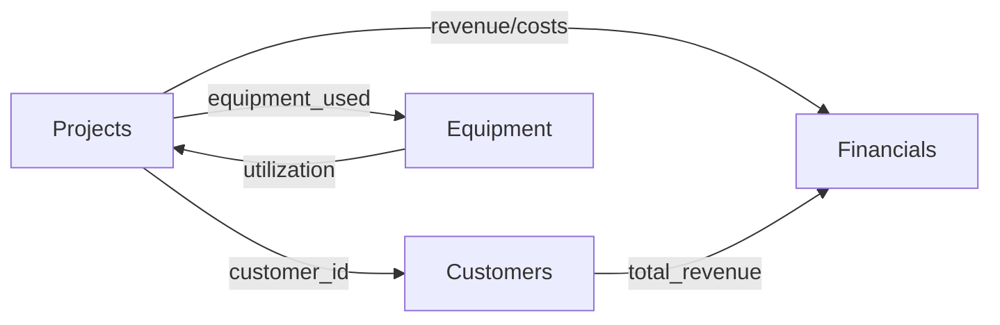

<!-- TOC -->

## Table of Contents

  - [Table of Contents](#table-of-contents)
  - [Quick Start](#quick-start)
    - [Accessing the Dashboard](#accessing-the-dashboard)
  - [Dashboard Overview](#dashboard-overview)
    - [What is the Business Dashboard?](#what-is-the-business-dashboard)
    - [Architecture](#architecture)
  - [Pages & Features](#pages-features)
    - [1. Main Dashboard (/dashboard/index.html)](#1-main-dashboard-dashboardindexhtml)
    - [2. Projects Management (/dashboard/projects.html)](#2-projects-management-dashboardprojectshtml)
      - [Summary Cards (5 KPIs)](#summary-cards-5-kpis)
      - [Advanced Filtering](#advanced-filtering)
      - [Projects Table](#projects-table)
      - [Export Options](#export-options)
    - [3. Financial Management (/dashboard/financials.html)](#3-financial-management-dashboardfinancialshtml)
      - [Financial KPIs (5 Cards)](#financial-kpis-5-cards)
      - [Date Range Filtering](#date-range-filtering)
      - [Revenue & Profit Trend Chart](#revenue-profit-trend-chart)
      - [Expense Breakdown](#expense-breakdown)
      - [Cash Flow Summary](#cash-flow-summary)
      - [Accounts Receivable Aging](#accounts-receivable-aging)
    - [4. Customer Management (/dashboard/customers.html)](#4-customer-management-dashboardcustomershtml)
      - [Customer KPIs (5 Cards)](#customer-kpis-5-cards)
      - [Customer Analytics Charts](#customer-analytics-charts)
      - [Advanced Filtering](#advanced-filtering)
      - [Customers Table](#customers-table)
  - [Data Management](#data-management)
    - [How the CMS Works](#how-the-cms-works)
    - [Data Relationships](#data-relationships)
  - [How to Update Data](#how-to-update-data)
    - [Option 1: Edit JSON Files Directly (Recommended for Bulk Updates)](#option-1-edit-json-files-directly-recommended-for-bulk-updates)
- [Windows](#windows)
- [Or use VS Code](#or-use-vs-code)
    - [Option 2: Through the Dashboard UI (Future Enhancement)](#option-2-through-the-dashboard-ui-future-enhancement)
      - [Add Edit Functionality (Example for Projects)](#add-edit-functionality-example-for-projects)
  - [API Endpoints](#api-endpoints)
    - [Authentication](#authentication)
    - [Dashboard Overview](#dashboard-overview)
    - [Data Endpoints](#data-endpoints)
  - [Adding New Data](#adding-new-data)
    - [Add a New Project](#add-a-new-project)
    - [Add a New Customer](#add-a-new-customer)
  - [Features Summary](#features-summary)
    - [✅ Current Features](#current-features)
    - [🚧 Future Enhancements](#future-enhancements)
  - [Troubleshooting](#troubleshooting)
    - [Dashboard Not Loading](#dashboard-not-loading)
- [Should see "Available on: http://127.0.0.1:8000"](#should-see-available-on-http1270018000)
    - [Data Not Updating](#data-not-updating)
    - [Charts Not Displaying](#charts-not-displaying)
  - [Security Notes](#security-notes)
    - [Demo Credentials](#demo-credentials)
    - [Production Checklist](#production-checklist)
  - [Support & Documentation](#support-documentation)
    - [Full Documentation](#full-documentation)
    - [Quick Links](#quick-links)

<!-- /TOC -->

# Business Dashboard - User Guide & CMS Documentation

**Version:** 1.0
**Last Updated:** October 23, 2025

## Table of Contents
1. [Quick Start](#quick-start)
2. [Dashboard Overview](#dashboard-overview)
3. [Pages & Features](#pages--features)
4. [Data Management](#data-management)
5. [API Endpoints](#api-endpoints)
6. [How to Update Data](#how-to-update-data)
7. [Authentication](#authentication)

---

## Quick Start

### Accessing the Dashboard

1. **Start the Server** (if not already running):
   ```bash
   cd C:\Users\Owner\Desktop\midwest-underground-website
   npx http-server -p 8000
   ```

2. **Open in Browser**:
   - Main Dashboard: http://localhost:8000/dashboard/
   - Projects: http://localhost:8000/dashboard/projects.html
   - Financials: http://localhost:8000/dashboard/financials.html
   - Customers: http://localhost:8000/dashboard/customers.html

3. **Demo Login Credentials**:
   ```
   Admin User:
   - Username: admin
   - Password: MidwestUnderground2025!
   - Permissions: Full access (view, edit, delete, financials, users)

   Manager User:
   - Username: manager
   - Password: Manager2025!
   - Permissions: View and edit access
   ```

---

## Dashboard Overview

### What is the Business Dashboard?

The Business Dashboard is a **comprehensive Content Management System (CMS)** designed specifically for Midwest Underground to:

- **Track Projects**: Monitor 15 active/completed projects worth $4.25M
- **Manage Finances**: View revenue, profit, expenses, and cash flow
- **Analyze Customers**: Track 13 customers with $14.5M lifetime value
- **Monitor Equipment**: Track 8 equipment items and utilization rates
- **Generate Reports**: Export data to CSV for offline analysis

### Architecture

```
dashboard/
├── index.html                  # Main Dashboard (Overview)
├── projects.html               # Projects Management
├── financials.html             # Financial Analytics
├── customers.html              # Customer Relationship Management
│
├── css/
│   └── dashboard.css           # Dashboard-specific styles (860+ lines)
│
├── js/
│   ├── dashboard.js            # Core dashboard logic
│   ├── charts.js               # Chart.js visualizations
│   ├── projects.js             # Projects page functionality
│   ├── financials.js           # Financials page functionality
│   └── customers.js            # Customers page functionality
│
└── api/
    ├── auth/
    │   └── login.php           # Authentication endpoint
    │
    ├── dashboard/
    │   └── overview.php        # Dashboard data aggregation
    │
    └── data/                   # JSON Data Store (CMS Backend)
        ├── projects.json       # 15 projects
        ├── customers.json      # 13 customers
        ├── financials.json     # 24 months of data
        └── equipment.json      # 8 equipment items
```

---

## Pages & Features

### 1. Main Dashboard (`/dashboard/index.html`)

**Purpose**: High-level business overview with real-time KPIs

**Features**:
- **6 KPI Cards**:
  - Revenue YTD: $4.25M (18.5% growth)
  - Active Projects: 7 projects
  - Profit Margin: 30.0%
  - Cash on Hand: $385K
  - Outstanding A/R: $415K
  - Customer Satisfaction: 4.8/5.0

- **4 Charts**:
  - Revenue Trend (12-month line chart)
  - Project Status (pie chart)
  - Service Revenue (bar chart)
  - Top Customers (table)

- **Activity Feed**: Recent actions and updates
- **Alert System**: Notifications for overdue invoices, maintenance

**Navigation**:
- Sidebar with icon navigation to all pages
- Dark mode toggle (synced across all pages)
- Logout button

---

### 2. Projects Management (`/dashboard/projects.html`)

**Purpose**: Comprehensive project tracking and management

**Key Features**:

#### Summary Cards (5 KPIs)
```
┌─────────────┬─────────────┬─────────────┬─────────────┬─────────────┐
│ Total       │ In Progress │ Completed   │ Planning    │ Total Value │
│ Projects    │             │             │             │             │
│ 15          │ 7           │ 6           │ 2           │ $4.25M      │
└─────────────┴─────────────┴─────────────┴─────────────┴─────────────┘
```

#### Advanced Filtering
```
┌─────────────────────────────────────────────────────────────────────┐
│ Filters                                                             │
├─────────────┬─────────────┬─────────────┬─────────────┬────────────┤
│ Status      │ Service     │ Customer    │ Search      │ Sort By    │
│ [All]       │ [All]       │ Type [All]  │ [________]  │ [Date ▼]   │
└─────────────┴─────────────┴─────────────┴─────────────┴────────────┘
```

**Filter Options**:
- **Status**: All, In Progress, Completed, Planning
- **Service Type**: Fiber Optic, HDD, Water/Sewer, Power, Geothermal
- **Customer Type**: Municipal, Commercial, Telecom, Residential, Industrial
- **Search**: Real-time search (300ms debounce)
- **Sort**: Date, Budget, Completion %, Name (A-Z/Z-A)

#### Projects Table
Displays 10 columns:
1. **Project ID** (e.g., PRJ-2024-001)
2. **Project Name** (full description)
3. **Customer** (with customer ID)
4. **Type** (color-coded badge)
5. **Service** (color-coded badge)
6. **Status** (color-coded badge)
7. **Progress %** (animated progress bar)
8. **Start Date**
9. **Completion Date**
10. **Budget** (formatted currency)
11. **Actions** (View 👁️, Edit ✏️ buttons)

#### Export Options
- **CSV Export**: All filtered data with full details
- **PDF Export**: Print dialog for reports

**Data Source**: `dashboard/api/data/projects.json`

---

### 3. Financial Management (`/dashboard/financials.html`)

**Purpose**: Revenue, expenses, cash flow, and A/R tracking

**Key Features**:

#### Financial KPIs (5 Cards)
```
Revenue YTD    Profit YTD    Profit Margin    Cash on Hand    A/R Outstanding
$4.25M         $1.28M        30.0%            $385K           $415K
(+18.5%)       (+22.3%)      (+2.3%)          2.1 mo runway   Avg 24 days
```

#### Date Range Filtering
```
┌──────────────────────────────────────────────────────────────────┐
│ Period: [Last 12 Months ▼]  Start: [2023-11-01]  End: [2024-10-31] │
│                                              [Apply Filter]       │
└──────────────────────────────────────────────────────────────────┘
```

**Preset Periods**:
- Last 12 Months
- Year to Date
- Last 24 Months
- Current Year
- Last Year
- Custom Date Range

#### Revenue & Profit Trend Chart
- **Type**: Line chart (dual-axis)
- **Data**: 12-month rolling view
- **Metrics**: Revenue (blue), Profit (light blue)
- **Interactive**: Hover for exact values

#### Expense Breakdown
- **Chart**: Doughnut chart with 5 categories
- **Table**: Category breakdown with percentages

**Categories**:
1. Labor & Payroll (35%)
2. Equipment & Vehicles (25%)
3. Materials & Supplies (20%)
4. Operations & Overhead (15%)
5. Insurance & Permits (5%)

#### Cash Flow Summary
```
┌────────────────────────────────────┐
│ Cash on Hand        $385,000  ✓   │
│ Accounts Receivable $415,000  ✓   │
│ Accounts Payable    -$125,000 ✗   │
│ ──────────────────────────────     │
│ Net Position        $675,000  ✓   │
│                                    │
│ Operating Runway: 2.1 months       │
│ (Based on $315K monthly expenses)  │
└────────────────────────────────────┘
```

#### Accounts Receivable Aging
Table with 8 columns:
1. Invoice ID
2. Customer
3. Amount
4. Invoice Date
5. Due Date
6. Days Outstanding
7. Status (Outstanding/Overdue)
8. Aging Category (Current, 1-30, 31-60, 61-90, 90+ days)

**Color Coding**:
- Current: Green
- 1-30 Days: Blue
- 31-60 Days: Yellow
- 61-90 Days: Orange
- 90+ Days: Red

**Data Source**: `dashboard/api/data/financials.json`

---

### 4. Customer Management (`/dashboard/customers.html`)

**Purpose**: Customer relationship tracking and analytics

**Key Features**:

#### Customer KPIs (5 Cards)
```
Total         Lifetime      Avg Customer   Active        Avg
Customers     Value         Value          Projects      Satisfaction
13            $14.5M        $1.12M         7             4.8 ⭐
              (+15.2%)      Per customer   Running       Out of 5.0
```

#### Customer Analytics Charts

**Chart 1: Customer Type Distribution** (Doughnut)
- Municipal (4 customers)
- Commercial (3 customers)
- Telecommunications (3 customers)
- Industrial (2 customers)
- Residential (1 customer)

**Chart 2: Top 5 Customers by Lifetime Value** (Horizontal Bar)
1. City of Willmar - $1.85M
2. CenturyLink Minnesota - $1.62M
3. Minnesota Department of Transportation - $1.48M
4. Kandiyohi County - $1.35M
5. Willmar Municipal Utilities - $1.28M

#### Advanced Filtering
```
┌────────────────────────────────────────────────────────────────┐
│ Customer Type: [All ▼]  Credit Rating: [All ▼]  Search: [...] │
│ Sort By: [Lifetime Value (Highest) ▼]      [Clear All]        │
└────────────────────────────────────────────────────────────────┘
```

**Sort Options**:
- Lifetime Value (Highest/Lowest)
- Total Projects (Most/Least)
- Satisfaction Score (Highest/Lowest)
- Name (A-Z / Z-A)

#### Customers Table
10 columns:
1. **Customer ID**
2. **Name**
3. **Type** (color badge)
4. **Contact** (name + title)
5. **Total Projects**
6. **Active Projects** (badge)
7. **Lifetime Value**
8. **Credit Rating** (A+, A, A-, B+, B)
9. **Satisfaction** (⭐ rating)
10. **Actions** (View, Edit buttons)

**Data Source**: `dashboard/api/data/customers.json`

---

## Data Management

### How the CMS Works

The dashboard uses **JSON files as a lightweight database**:

```
dashboard/api/data/
├── projects.json       # 15 projects (450+ lines)
├── customers.json      # 13 customers (350+ lines)
├── financials.json     # 24 months data (600+ lines)
└── equipment.json      # 8 equipment items (200+ lines)
```

### Data Relationships



---

## How to Update Data

### Option 1: Edit JSON Files Directly (Recommended for Bulk Updates)

1. **Open the JSON file**:
   ```bash
   # Windows
   notepad "C:\Users\Owner\Desktop\midwest-underground-website\dashboard\api\data\projects.json"

   # Or use VS Code
   code "C:\Users\Owner\Desktop\midwest-underground-website\dashboard\api\data\projects.json"
   ```

2. **Make your changes** following the existing structure

3. **Validate JSON** using online tool: https://jsonlint.com/

4. **Save and refresh** the browser

### Option 2: Through the Dashboard UI (Future Enhancement)

Currently, the dashboard is **read-only**. To make it editable:

#### Add Edit Functionality (Example for Projects)

Create `dashboard/api/projects/update.php`:

```php
<?php
header('Content-Type: application/json');

// Read POST data
$input = json_decode(file_get_contents('php://input'), true);

// Load projects
$projectsFile = '../data/projects.json';
$data = json_decode(file_get_contents($projectsFile), true);

// Find and update project
foreach ($data['projects'] as &$project) {
  if ($project['id'] === $input['id']) {
    $project = array_merge($project, $input);
    break;
  }
}

// Save back to file
file_put_contents($projectsFile, json_encode($data, JSON_PRETTY_PRINT));

echo json_encode(['success' => true]);
?>
```

Add JavaScript in `dashboard/js/projects.js`:

```javascript
async function saveProject(projectData) {
  const response = await fetch('/dashboard/api/projects/update.php', {
    method: 'POST',
    headers: { 'Content-Type': 'application/json' },
    body: JSON.stringify(projectData)
  });

  const result = await response.json();
  if (result.success) {
    showNotification('Project saved successfully!', 'success');
    loadProjectsData(); // Refresh table
  }
}
```

---

## API Endpoints

### Authentication

**Endpoint**: `POST /dashboard/api/auth/login.php`

**Request**:
```json
{
  "username": "admin",
  "password": "MidwestUnderground2025!"
}
```

**Response** (Success):
```json
{
  "success": true,
  "user": {
    "username": "admin",
    "role": "admin",
    "permissions": ["view", "edit", "delete", "financials", "users"]
  }
}
```

**Response** (Failure):
```json
{
  "success": false,
  "error": "Invalid username or password"
}
```

### Dashboard Overview

**Endpoint**: `GET /dashboard/api/dashboard/overview.php`

**Response**:
```json
{
  "success": true,
  "data": {
    "kpis": {
      "revenue_ytd": 4250000,
      "active_projects": 7,
      "profit_margin": 30.0,
      "cash_on_hand": 385000,
      "ar_outstanding": 415000,
      "customer_satisfaction": 4.8
    },
    "project_status": [
      { "status": "In Progress", "count": 7 },
      { "status": "Completed", "count": 6 },
      { "status": "Planning", "count": 2 }
    ],
    "revenue_by_service": [...],
    "top_customers": [...]
  }
}
```

### Data Endpoints

All data endpoints are static JSON files served directly:

- **Projects**: `GET /dashboard/api/data/projects.json`
- **Customers**: `GET /dashboard/api/data/customers.json`
- **Financials**: `GET /dashboard/api/data/financials.json`
- **Equipment**: `GET /dashboard/api/data/equipment.json`

---

## Adding New Data

### Add a New Project

1. Open `dashboard/api/data/projects.json`

2. Copy an existing project object

3. Update all fields:

```json
{
  "id": "PRJ-2024-016",
  "name": "New Project Name",
  "customer_id": "CUST-001",
  "customer_name": "City of Willmar",
  "type": "Municipal",
  "service": "Fiber Optic Installation",
  "status": "Planning",
  "start_date": "2024-11-01",
  "estimated_completion": "2025-01-15",
  "completion_percentage": 0,
  "budget": 150000,
  "actual_cost": 0,
  "projected_revenue": 150000,
  "profit_margin": 25,
  "project_manager": "Your Name",
  "crew_assigned": "Crew B",
  "location": "City, MN",
  "priority": "Medium",
  "notes": "Project description here"
}
```

4. Add comma after previous project, paste new project

5. Save file and refresh dashboard

### Add a New Customer

Similar process with `dashboard/api/data/customers.json`:

```json
{
  "id": "CUST-014",
  "name": "New Customer Inc",
  "type": "Commercial",
  "contact_name": "John Doe",
  "contact_title": "Operations Manager",
  "email": "john@newcustomer.com",
  "phone": "(320) 555-1234",
  "address": "123 Main St, Willmar, MN 56201",
  "total_projects": 1,
  "active_projects": 1,
  "total_revenue": 50000,
  "lifetime_value": 50000,
  "avg_project_value": 50000,
  "first_project_date": "2024-10-23",
  "last_project_date": "2024-10-23",
  "payment_terms": "Net 30",
  "credit_rating": "A",
  "satisfaction_score": 5.0,
  "notes": "New customer notes"
}
```

---

## Features Summary

### ✅ Current Features

- **Real-time Filtering**: Multi-criteria filters with debounced search
- **Data Visualization**: Chart.js with 6 different chart types
- **Export Capabilities**: CSV export on all pages
- **Dark Mode**: Full theme support across dashboard
- **Responsive Design**: Works on desktop, tablet, mobile
- **JSON-based CMS**: Easy to update without database
- **Session Management**: Login/logout with role-based permissions
- **Data Validation**: Client-side validation for all inputs

### 🚧 Future Enhancements

- **CRUD Operations**: Add/Edit/Delete directly from UI
- **Real-time Updates**: WebSocket or polling for live data
- **Advanced Reports**: PDF generation with charts
- **File Upload**: Attach documents to projects
- **Email Notifications**: Alerts for overdue invoices
- **Equipment Scheduling**: Calendar view for crew assignments
- **Mobile App**: Native iOS/Android apps
- **API Documentation**: Swagger/OpenAPI specs
- **Database Migration**: Move from JSON to MySQL/PostgreSQL
- **Multi-user Collaboration**: Real-time concurrent editing

---

## Troubleshooting

### Dashboard Not Loading

1. **Check server is running**:
   ```bash
   # Should see "Available on: http://127.0.0.1:8000"
   ```

2. **Check browser console** (F12):
   - Look for 404 errors
   - Check Network tab for failed requests

3. **Hard refresh**: `Ctrl + Shift + R` (Windows) or `Cmd + Shift + R` (Mac)

### Data Not Updating

1. **Clear browser cache**: `Ctrl + Shift + Delete`

2. **Validate JSON syntax**: Use https://jsonlint.com/

3. **Check file permissions**: Ensure files are readable

### Charts Not Displaying

1. **Check Chart.js loaded**: Open browser console, type `Chart` - should see object

2. **Check data format**: Ensure JSON arrays are properly formatted

3. **Check browser compatibility**: Use Chrome 90+, Firefox 88+, Safari 14+

---

## Security Notes

### Demo Credentials

**IMPORTANT**: Change default passwords before deploying to production!

Edit `dashboard/api/auth/login.php`:

```php
$users = [
  'admin' => [
    'password' => password_hash('YOUR_NEW_PASSWORD', PASSWORD_BCRYPT, ['cost' => 12]),
    'role' => 'admin',
    'permissions' => ['view', 'edit', 'delete', 'financials', 'users']
  ]
];
```

### Production Checklist

- [ ] Change all default passwords
- [ ] Enable HTTPS/SSL
- [ ] Add CSRF protection
- [ ] Implement rate limiting
- [ ] Add input sanitization
- [ ] Enable audit logging
- [ ] Backup JSON files regularly
- [ ] Set proper file permissions (644 for files, 755 for directories)
- [ ] Add .htaccess protection for /api/data/ directory
- [ ] Implement session timeout (30 minutes)

---

## Support & Documentation

### Full Documentation
- **Dashboard Spec**: [docs/features/BUSINESS-DASHBOARD.md](features/BUSINESS-DASHBOARD.md)
- **Architecture**: [docs/architecture/OVERVIEW.md](architecture/OVERVIEW.md)
- **Dark Mode Testing**: [docs/DARK-MODE-TEST-PLAN.md](DARK-MODE-TEST-PLAN.md)

### Quick Links
- **GitHub**: https://github.com/nice-and-precise/midwest-underground-website
- **Issues**: Report bugs via GitHub Issues
- **README**: [README.md](../README.md)

---

**Built with:** HTML5, CSS3, JavaScript ES6+, Chart.js 4.4, PHP 8.0+
**Last Updated:** October 23, 2025
**Version:** 1.0.0
