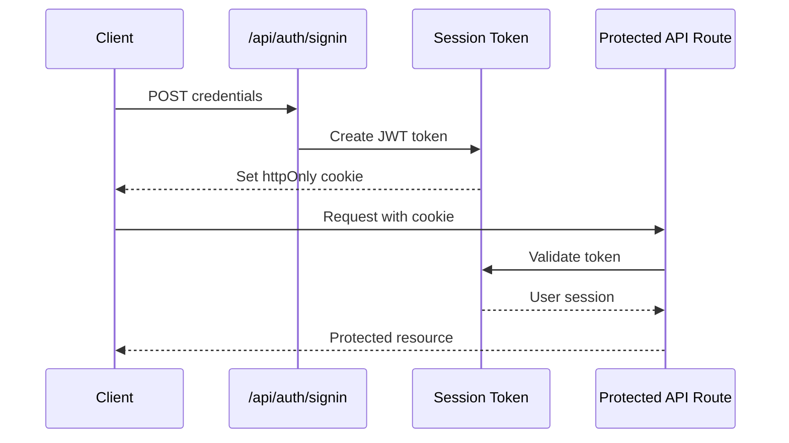

# API Reference

**Last Updated:** 2025-11-23
**Version:** 1.0.0
**Base URL:** `/api`
**Authentication:** NextAuth v5 Session-based

---

## Table of Contents

- [Overview](#overview)
- [Authentication](#authentication)
- [Common Patterns](#common-patterns)
- [Response Format](#response-format)
- [Error Handling](#error-handling)
- [Rate Limiting](#rate-limiting)
- [Authentication Endpoints](#authentication-endpoints)
- [Project Management](#project-management)
- [Bore Log Management](#bore-log-management)
- [HDD Operations](#hdd-operations)
- [Photo Management](#photo-management)
- [KPI & Analytics](#kpi--analytics)
- [Inspection Management](#inspection-management)
- [811 Compliance](#811-compliance)
- [Field Equipment](#field-equipment)
- [Customer Management](#customer-management)
- [Financial Reporting](#financial-reporting)

---

## Overview

The Midwest Underground API is a RESTful API built on Next.js 15 API Routes. All endpoints follow REST conventions and return JSON responses.

### API Architecture

```mermaid
graph TB
    Client[HTTP Client] --> Middleware[Next.js Middleware]
    Middleware --> Auth{Authenticated?}
    Auth -->|Yes| Routes[API Routes]
    Auth -->|No| Deny[401 Unauthorized]
    Routes --> Validation[Zod Validation]
    Validation --> Prisma[Prisma ORM]
    Prisma --> DB[(Database)]

    style Auth fill:#FF5A1F
    style Validation fill:#4F5B66
    style Prisma fill:#23272A
```



### Key Features

- **RESTful Design** - Standard HTTP methods (GET, POST, PUT, DELETE)
- **Type Safety** - Zod schemas for runtime validation
- **Session-based Auth** - NextAuth v5 with role-based access control
- **Consistent Errors** - Standardized error response format
- **Relational Data** - Support for nested includes and filtering

---

## Authentication

### Session-based Authentication

All protected endpoints require a valid NextAuth session. Sessions are established via the `/api/auth` endpoints and stored in httpOnly cookies.



### Required Headers

```http
Cookie: next-auth.session-token=<token>
Content-Type: application/json
```

### Role-Based Access Control

| Role | Permissions |
|------|------------|
| **OWNER** | Full access to all endpoints |
| **SUPER** | Create/edit projects, approve reports, manage operations |
| **CREW** | Submit reports, log bores, view assigned work |

---

## Common Patterns

### Query Parameters

```http
GET /api/projects?status=IN_PROGRESS&limit=10&offset=0
```

Common query params across endpoints:
- `status` - Filter by status enum
- `limit` - Pagination limit (default: 50)
- `offset` - Pagination offset (default: 0)
- `orderBy` - Sort field (default: `createdAt`)
- `order` - Sort direction (`asc` or `desc`)

### Request Body Validation

All POST/PUT requests validate against Zod schemas:

```typescript
// Example: Project creation
{
  "name": "string (required)",
  "description": "string (optional)",
  "status": "PLANNING | IN_PROGRESS | COMPLETED | ON_HOLD",
  "startDate": "ISO 8601 datetime",
  "budget": "number (optional)",
  "createdById": "string (required)"
}
```

### Nested Includes

Use `include` query param for relational data:

```http
GET /api/projects/123?include=bores,dailyReports
```

---

## Response Format

### Success Response

```json
{
  "project": {
    "id": "clxxx",
    "name": "I-94 Fiber Expansion",
    "status": "IN_PROGRESS",
    "createdAt": "2025-01-15T10:30:00Z",
    "createdBy": {
      "id": "clyyy",
      "name": "John Doe",
      "role": "OWNER"
    },
    "_count": {
      "bores": 5,
      "dailyReports": 12
    }
  }
}
```

### List Response

```json
{
  "projects": [
    { "id": "cl1", "name": "Project 1" },
    { "id": "cl2", "name": "Project 2" }
  ],
  "pagination": {
    "total": 25,
    "limit": 10,
    "offset": 0,
    "hasMore": true
  }
}
```

---

## Error Handling

### Error Response Format

```json
{
  "error": "Human-readable error message",
  "code": "ERROR_CODE",
  "details": {
    "field": "Specific error details"
  }
}
```

### HTTP Status Codes

| Code | Meaning | Description |
|------|---------|-------------|
| 200 | OK | Successful GET/PUT/DELETE |
| 201 | Created | Successful POST (resource created) |
| 400 | Bad Request | Invalid request body or parameters |
| 401 | Unauthorized | Missing or invalid authentication |
| 403 | Forbidden | Valid auth but insufficient permissions |
| 404 | Not Found | Resource does not exist |
| 422 | Unprocessable Entity | Validation error (Zod) |
| 500 | Internal Server Error | Server error |

### Common Error Examples

```json
// 400 Bad Request - Validation Error
{
  "error": "Validation failed",
  "details": [
    {
      "path": ["name"],
      "message": "Required field"
    },
    {
      "path": ["budget"],
      "message": "Must be a positive number"
    }
  ]
}

// 401 Unauthorized
{
  "error": "Authentication required",
  "code": "UNAUTHORIZED"
}

// 403 Forbidden - Insufficient Permissions
{
  "error": "Insufficient permissions",
  "code": "FORBIDDEN",
  "details": {
    "required": "OWNER",
    "actual": "CREW"
  }
}

// 404 Not Found
{
  "error": "Project not found",
  "code": "NOT_FOUND",
  "resourceId": "clxxx"
}
```

---

## Rate Limiting

**Status:** To be implemented in production

Planned rate limits:
- **Authenticated users:** 1000 requests/hour
- **By IP:** 100 requests/hour for public endpoints
- **Photo uploads:** 50 uploads/hour

---

## Authentication Endpoints

### POST /api/auth/signin

Sign in with email and password.

**Request:**
```http
POST /api/auth/signin
Content-Type: application/json

{
  "email": "owner@midwestunderground.com",
  "password": "password123"
}
```

**Response (200 OK):**
```json
{
  "user": {
    "id": "clxxx",
    "email": "owner@midwestunderground.com",
    "name": "John Doe",
    "role": "OWNER"
  },
  "session": {
    "expires": "2025-12-31T23:59:59Z"
  }
}
```

**Errors:**
- `401` - Invalid credentials
- `400` - Missing email or password

---

### POST /api/auth/signout

Sign out and destroy session.

**Request:**
```http
POST /api/auth/signout
```

**Response (200 OK):**
```json
{
  "success": true
}
```

---

### GET /api/auth/session

Get current user session.

**Request:**
```http
GET /api/auth/session
```

**Response (200 OK):**
```json
{
  "user": {
    "id": "clxxx",
    "email": "owner@midwestunderground.com",
    "name": "John Doe",
    "role": "OWNER"
  },
  "expires": "2025-12-31T23:59:59Z"
}
```

**Response (401 Unauthorized):**
```json
{
  "user": null
}
```

---

## Project Management

### GET /api/projects

List all projects with optional filtering.

**Request:**
```http
GET /api/projects?status=IN_PROGRESS&limit=10
```

**Query Parameters:**
- `status` (optional) - Filter by ProjectStatus enum
- `limit` (optional) - Results per page (default: 50)
- `offset` (optional) - Pagination offset (default: 0)

**Response (200 OK):**
```json
{
  "projects": [
    {
      "id": "clxxx",
      "name": "I-94 Fiber Expansion",
      "description": "Broadband infrastructure project",
      "status": "IN_PROGRESS",
      "startDate": "2025-01-15T00:00:00Z",
      "endDate": null,
      "budget": 125000.00,
      "location": {
        "type": "Point",
        "coordinates": [-93.2650, 44.9778]
      },
      "customerName": "Fiber Solutions Inc",
      "customerContact": "jane@fibersolutions.com",
      "createdAt": "2025-01-10T14:30:00Z",
      "updatedAt": "2025-01-15T09:15:00Z",
      "createdBy": {
        "id": "clyyy",
        "name": "John Doe",
        "email": "john@example.com",
        "role": "OWNER"
      },
      "_count": {
        "bores": 5,
        "dailyReports": 12,
        "inspections": 3,
        "tickets811": 2
      }
    }
  ]
}
```

**Permissions:** All authenticated users

---

### POST /api/projects

Create a new project.

**Request:**
```http
POST /api/projects
Content-Type: application/json

{
  "name": "I-94 Fiber Expansion",
  "description": "Broadband infrastructure project",
  "status": "PLANNING",
  "startDate": "2025-02-01T00:00:00Z",
  "budget": 125000.00,
  "customerName": "Fiber Solutions Inc",
  "customerContact": "jane@fibersolutions.com",
  "createdById": "clyyy"
}
```

**Response (201 Created):**
```json
{
  "project": {
    "id": "clxxx",
    "name": "I-94 Fiber Expansion",
    "status": "PLANNING",
    "createdAt": "2025-01-23T10:30:00Z",
    "createdBy": {
      "id": "clyyy",
      "name": "John Doe",
      "role": "OWNER"
    }
  }
}
```

**Validation Rules:**
- `name` - Required, min 3 characters
- `status` - Must be valid ProjectStatus enum
- `budget` - Must be positive number if provided
- `createdById` - Must be valid user ID

**Permissions:** OWNER, SUPER

---

### GET /api/projects/:id

Get project details by ID.

**Request:**
```http
GET /api/projects/clxxx?include=bores,dailyReports
```

**Query Parameters:**
- `include` (optional) - Comma-separated relations to include

**Response (200 OK):**
```json
{
  "project": {
    "id": "clxxx",
    "name": "I-94 Fiber Expansion",
    "status": "IN_PROGRESS",
    "bores": [
      {
        "id": "clzzz",
        "name": "Bore 1",
        "status": "COMPLETED",
        "totalLength": 850.5
      }
    ],
    "dailyReports": [
      {
        "id": "claaa",
        "reportDate": "2025-01-22T00:00:00Z",
        "status": "APPROVED"
      }
    ]
  }
}
```

**Errors:**
- `404` - Project not found

**Permissions:** All authenticated users

---

### PUT /api/projects/:id

Update project by ID.

**Request:**
```http
PUT /api/projects/clxxx
Content-Type: application/json

{
  "name": "I-94 Fiber Expansion (Updated)",
  "status": "IN_PROGRESS",
  "budget": 135000.00
}
```

**Response (200 OK):**
```json
{
  "project": {
    "id": "clxxx",
    "name": "I-94 Fiber Expansion (Updated)",
    "status": "IN_PROGRESS",
    "budget": 135000.00,
    "updatedAt": "2025-01-23T11:45:00Z"
  }
}
```

**Permissions:** OWNER, SUPER

---

### DELETE /api/projects/:id

Delete project by ID (cascade deletes all related data).

**Request:**
```http
DELETE /api/projects/clxxx
```

**Response (200 OK):**
```json
{
  "success": true,
  "message": "Project deleted successfully"
}
```

**⚠️ Warning:** This is a destructive operation that cascades to:
- All bores
- All daily reports
- All inspections
- All RFIs, T&M tickets, change orders
- All 811 tickets
- All events
- All photos

**Permissions:** OWNER only

---

## Bore Log Management

### GET /api/bore-logs

List all bore logs with optional filtering.

**Request:**
```http
GET /api/bore-logs?projectId=clxxx&status=IN_PROGRESS
```

**Query Parameters:**
- `projectId` (optional) - Filter by project
- `status` (optional) - Filter by BoreStatus enum

**Response (200 OK):**
```json
{
  "bores": [
    {
      "id": "clzzz",
      "projectId": "clxxx",
      "name": "Bore 1 - Main Line",
      "status": "IN_PROGRESS",
      "diameterIn": 4.5,
      "productMaterial": "HDPE",
      "tracerWire": true,
      "totalLength": 850.5,
      "alignment": {
        "type": "LineString",
        "coordinates": [[...], [...]]
      },
      "depthProfile": [
        {"station": 0, "depth": 6.5, "elevation": 945.2},
        {"station": 100, "depth": 8.2, "elevation": 943.5}
      ],
      "_count": {
        "rodPasses": 15
      }
    }
  ]
}
```

**Permissions:** All authenticated users

---

### POST /api/bore-logs

Create a new bore log.

**Request:**
```http
POST /api/bore-logs
Content-Type: application/json

{
  "projectId": "clxxx",
  "name": "Bore 2 - Branch Line",
  "status": "PLANNED",
  "diameterIn": 3.0,
  "productMaterial": "HDPE",
  "tracerWire": true,
  "entryPitId": "clppp",
  "exitPitId": "clqqq"
}
```

**Response (201 Created):**
```json
{
  "bore": {
    "id": "clzzz",
    "name": "Bore 2 - Branch Line",
    "status": "PLANNED",
    "createdAt": "2025-01-23T12:00:00Z"
  }
}
```

**Validation Rules:**
- `projectId` - Required, must exist
- `name` - Required, min 3 characters
- `diameterIn` - Must be positive number
- `alignment` - Must be valid GeoJSON LineString if provided
- `entryPitId`, `exitPitId` - Must be valid pit IDs if provided

**Permissions:** OWNER, SUPER, CREW

---

### GET /api/bore-logs/:id

Get bore log details with rod passes.

**Request:**
```http
GET /api/bore-logs/clzzz?include=rodPasses
```

**Response (200 OK):**
```json
{
  "bore": {
    "id": "clzzz",
    "name": "Bore 1 - Main Line",
    "status": "COMPLETED",
    "totalLength": 850.5,
    "rodPasses": [
      {
        "id": "clrrr",
        "sequence": 1,
        "passNumber": 1,
        "linearFeet": 50.0,
        "fluidMix": "Bentonite",
        "completedAt": "2025-01-20T14:30:00Z"
      }
    ]
  }
}
```

**Permissions:** All authenticated users

---

### PUT /api/bore-logs/:id

Update bore log.

**Request:**
```http
PUT /api/bore-logs/clzzz
Content-Type: application/json

{
  "status": "COMPLETED",
  "totalLength": 850.5
}
```

**Response (200 OK):**
```json
{
  "bore": {
    "id": "clzzz",
    "status": "COMPLETED",
    "totalLength": 850.5,
    "updatedAt": "2025-01-23T13:15:00Z"
  }
}
```

**Permissions:** OWNER, SUPER, CREW

---

### DELETE /api/bore-logs/:id

Delete bore log (cascade deletes rod passes, photos).

**Request:**
```http
DELETE /api/bore-logs/clzzz
```

**Response (200 OK):**
```json
{
  "success": true
}
```

**Permissions:** OWNER, SUPER

---

## HDD Operations

### POST /api/hdd/rod-passes

Create rod-by-rod drilling log entry.

**Request:**
```http
POST /api/hdd/rod-passes
Content-Type: application/json

{
  "boreId": "clzzz",
  "sequence": 1,
  "passNumber": 1,
  "linearFeet": 50.0,
  "fluidMix": "Bentonite",
  "fluidVolumeGal": 150.0,
  "startedAt": "2025-01-20T13:00:00Z",
  "completedAt": "2025-01-20T14:30:00Z",
  "notes": "Good steering, no obstructions",
  "loggedById": "clyyy"
}
```

**Response (201 Created):**
```json
{
  "rodPass": {
    "id": "clrrr",
    "sequence": 1,
    "passNumber": 1,
    "linearFeet": 50.0,
    "createdAt": "2025-01-20T14:30:00Z"
  }
}
```

**Validation Rules:**
- `boreId` - Required, must exist
- `sequence` - Required, positive integer
- `passNumber` - Required, positive integer (1=Pilot, 2+=Reaming)
- `linearFeet` - Required, positive number
- `loggedById` - Required, must exist

**Permissions:** All authenticated users

---

### GET /api/hdd/rod-passes

List rod passes with optional filtering.

**Request:**
```http
GET /api/hdd/rod-passes?boreId=clzzz&passNumber=1
```

**Response (200 OK):**
```json
{
  "rodPasses": [
    {
      "id": "clrrr",
      "boreId": "clzzz",
      "sequence": 1,
      "passNumber": 1,
      "linearFeet": 50.0,
      "fluidMix": "Bentonite",
      "completedAt": "2025-01-20T14:30:00Z"
    }
  ]
}
```

**Permissions:** All authenticated users

---

### POST /api/hdd/daily-reports

Create daily field report.

**Request:**
```http
POST /api/hdd/daily-reports
Content-Type: application/json

{
  "projectId": "clxxx",
  "reportDate": "2025-01-22T00:00:00Z",
  "crew": [
    {"name": "John Doe", "role": "Operator", "hours": 8.0},
    {"name": "Jane Smith", "role": "Locator", "hours": 8.0}
  ],
  "production": [
    {
      "boreId": "clzzz",
      "activity": "Pilot bore",
      "lf": 250.0,
      "startTime": "07:00",
      "endTime": "15:00"
    }
  ],
  "labor": [
    {"name": "John Doe", "hours": 8.0, "rate": 65.00, "total": 520.00}
  ],
  "equipment": [
    {"name": "Drill Rig", "hours": 8.0, "rate": 250.00, "total": 2000.00}
  ],
  "materials": [
    {"description": "Bentonite", "qty": 50, "unit": "bags", "cost": 15.00, "total": 750.00}
  ],
  "weather": {
    "condition": "Clear",
    "temp": 45,
    "impact": "None"
  },
  "notes": "Smooth operation, on schedule",
  "status": "DRAFT",
  "createdById": "clyyy"
}
```

**Response (201 Created):**
```json
{
  "dailyReport": {
    "id": "claaa",
    "projectId": "clxxx",
    "reportDate": "2025-01-22T00:00:00Z",
    "status": "DRAFT",
    "createdAt": "2025-01-22T16:30:00Z"
  }
}
```

**Validation Rules:**
- Unique constraint: One report per project per day
- `crew` - Array of crew members with name, role, hours
- `production` - Array of production activities
- `labor`, `equipment`, `materials` - Arrays with cost tracking

**Permissions:** All authenticated users

---

### GET /api/hdd/daily-reports

List daily reports with filtering.

**Request:**
```http
GET /api/hdd/daily-reports?projectId=clxxx&status=APPROVED
```

**Response (200 OK):**
```json
{
  "dailyReports": [
    {
      "id": "claaa",
      "projectId": "clxxx",
      "reportDate": "2025-01-22T00:00:00Z",
      "status": "APPROVED",
      "signedBy": {
        "name": "John Doe",
        "email": "john@example.com"
      },
      "signedAt": "2025-01-23T08:00:00Z"
    }
  ]
}
```

**Permissions:** All authenticated users

---

### GET /api/hdd/daily-reports/:id

Get daily report details with audit trail.

**Request:**
```http
GET /api/hdd/daily-reports/claaa?include=auditLogs
```

**Response (200 OK):**
```json
{
  "dailyReport": {
    "id": "claaa",
    "reportDate": "2025-01-22T00:00:00Z",
    "crew": [...],
    "production": [...],
    "status": "APPROVED",
    "signedBy": {
      "name": "John Doe"
    },
    "auditLogs": [
      {
        "id": "claaa_audit_1",
        "changedAt": "2025-01-23T08:00:00Z",
        "changedBy": {"name": "John Doe"},
        "changes": {
          "status": {"from": "SUBMITTED", "to": "APPROVED"}
        }
      }
    ]
  }
}
```

**Permissions:** All authenticated users

---

### PUT /api/hdd/daily-reports/:id

Update daily report (creates audit log entry).

**Request:**
```http
PUT /api/hdd/daily-reports/claaa
Content-Type: application/json

{
  "status": "APPROVED",
  "signedById": "clyyy"
}
```

**Response (200 OK):**
```json
{
  "dailyReport": {
    "id": "claaa",
    "status": "APPROVED",
    "signedAt": "2025-01-23T08:00:00Z",
    "updatedAt": "2025-01-23T08:00:00Z"
  }
}
```

**Permissions:** SUPER, OWNER (for approval)

---

### GET /api/hdd/kpis

Get HDD operations KPIs.

**Request:**
```http
GET /api/hdd/kpis?projectId=clxxx
```

**Response (200 OK):**
```json
{
  "kpis": {
    "totalLinearFeet": 5420.5,
    "boreshCompletedThisWeek": 3,
    "activeProjects": 2,
    "crewUtilization": 85.5,
    "avgLinearFeetPerDay": 380.2
  }
}
```

**Permissions:** OWNER, SUPER

---

### POST /api/hdd/811-tickets

Create 811 locate ticket.

**Request:**
```http
POST /api/hdd/811-tickets
Content-Type: application/json

{
  "projectId": "clxxx",
  "ticketNumber": "MN-2025-012345",
  "ticketDate": "2025-01-15T00:00:00Z",
  "expirationDate": "2025-01-29T00:00:00Z",
  "status": "ACTIVE",
  "notes": "Underground utilities marked by all providers"
}
```

**Response (201 Created):**
```json
{
  "ticket811": {
    "id": "clttt",
    "ticketNumber": "MN-2025-012345",
    "status": "ACTIVE",
    "expirationDate": "2025-01-29T00:00:00Z"
  }
}
```

**Permissions:** All authenticated users

---

### GET /api/hdd/811-tickets

List 811 tickets with filtering.

**Request:**
```http
GET /api/hdd/811-tickets?status=ACTIVE&expiringSoon=true
```

**Query Parameters:**
- `status` - Filter by Ticket811Status
- `expiringSoon` - Boolean, tickets expiring in next 7 days

**Response (200 OK):**
```json
{
  "tickets811": [
    {
      "id": "clttt",
      "ticketNumber": "MN-2025-012345",
      "expirationDate": "2025-01-29T00:00:00Z",
      "status": "ACTIVE",
      "daysUntilExpiration": 6,
      "_count": {
        "responses": 3
      }
    }
  ]
}
```

**Permissions:** All authenticated users

---

### POST /api/hdd/811-tickets/:id/responses

Add utility response to 811 ticket.

**Request:**
```http
POST /api/hdd/811-tickets/clttt/responses
Content-Type: application/json

{
  "utilityName": "Xcel Energy",
  "responseType": "Positive",
  "responseDate": "2025-01-16T00:00:00Z",
  "marksDescription": "Electric lines marked in yellow",
  "respondedById": "clyyy"
}
```

**Response (201 Created):**
```json
{
  "response": {
    "id": "clres",
    "utilityName": "Xcel Energy",
    "responseType": "Positive",
    "responseDate": "2025-01-16T00:00:00Z"
  }
}
```

**Permissions:** All authenticated users

---

## Photo Management

### POST /api/photos/upload

Upload photos with metadata.

**Request:**
```http
POST /api/photos/upload
Content-Type: multipart/form-data

{
  "file": <binary>,
  "boreId": "clzzz",
  "caption": "Bore entry point"
}
```

**Response (201 Created):**
```json
{
  "photo": {
    "id": "clppp",
    "filename": "bore_entry_20250123.jpg",
    "url": "/uploads/photos/bore_entry_20250123.jpg",
    "thumbnailUrl": "/uploads/photos/thumbs/bore_entry_20250123.jpg",
    "size": 245680,
    "mimeType": "image/jpeg",
    "boreId": "clzzz",
    "createdAt": "2025-01-23T14:00:00Z"
  }
}
```

**Validation Rules:**
- Max file size: 10MB
- Allowed types: image/jpeg, image/png
- Must specify one of: boreId, inspectionId, dailyReportId

**Permissions:** All authenticated users

---

### GET /api/photos/bore/:id

Get all photos for a bore.

**Request:**
```http
GET /api/photos/bore/clzzz
```

**Response (200 OK):**
```json
{
  "photos": [
    {
      "id": "clppp",
      "filename": "bore_entry_20250123.jpg",
      "url": "/uploads/photos/bore_entry_20250123.jpg",
      "thumbnailUrl": "/uploads/photos/thumbs/bore_entry_20250123.jpg",
      "createdAt": "2025-01-23T14:00:00Z"
    }
  ]
}
```

**Permissions:** All authenticated users

---

### DELETE /api/photos/:id

Delete photo.

**Request:**
```http
DELETE /api/photos/clppp
```

**Response (200 OK):**
```json
{
  "success": true
}
```

**Permissions:** OWNER, SUPER (or photo uploader)

---

## KPI & Analytics

### GET /api/kpis/overview

Get overall KPI dashboard data.

**Request:**
```http
GET /api/kpis/overview
```

**Response (200 OK):**
```json
{
  "kpis": {
    "activeProjects": 5,
    "totalLinearFeet": 12540.5,
    "completedBores": 28,
    "crewUtilization": 87.3,
    "avgLinearFeetPerDay": 420.8,
    "revenueThisMonth": 285000.00,
    "pendingInspections": 7,
    "expiring811Tickets": 2
  }
}
```

**Permissions:** OWNER, SUPER

---

### GET /api/kpis/project/:id

Get project-specific KPIs.

**Request:**
```http
GET /api/kpis/project/clxxx
```

**Response (200 OK):**
```json
{
  "kpis": {
    "projectId": "clxxx",
    "totalLinearFeet": 2850.5,
    "completedBores": 5,
    "inProgressBores": 2,
    "avgLinearFeetPerDay": 380.2,
    "laborCostToDate": 45000.00,
    "equipmentCostToDate": 180000.00,
    "materialsCostToDate": 32000.00,
    "totalCost": 257000.00,
    "budgetRemaining": 68000.00,
    "percentComplete": 75.5
  }
}
```

**Permissions:** OWNER, SUPER

---

## Inspection Management

### POST /api/inspections

Create QA/QC inspection.

**Request:**
```http
POST /api/inspections
Content-Type: application/json

{
  "projectId": "clxxx",
  "boreId": "clzzz",
  "templateName": "Pre-Bore Checklist",
  "items": [
    {
      "question": "Is the bore path marked?",
      "answer": "Yes",
      "pass": true,
      "notes": ""
    },
    {
      "question": "Are utilities located and marked?",
      "answer": "Yes",
      "pass": true,
      "notes": "All utilities marked by 811 providers"
    }
  ],
  "assigneeId": "clyyy",
  "dueDate": "2025-01-25T00:00:00Z",
  "status": "OPEN",
  "createdById": "clyyy"
}
```

**Response (201 Created):**
```json
{
  "inspection": {
    "id": "clinsp",
    "templateName": "Pre-Bore Checklist",
    "status": "OPEN",
    "dueDate": "2025-01-25T00:00:00Z",
    "createdAt": "2025-01-23T15:00:00Z"
  }
}
```

**Permissions:** OWNER, SUPER

---

### GET /api/inspections

List inspections with filtering.

**Request:**
```http
GET /api/inspections?projectId=clxxx&status=OPEN
```

**Response (200 OK):**
```json
{
  "inspections": [
    {
      "id": "clinsp",
      "templateName": "Pre-Bore Checklist",
      "status": "OPEN",
      "dueDate": "2025-01-25T00:00:00Z",
      "assignee": {
        "name": "John Doe"
      }
    }
  ]
}
```

**Permissions:** All authenticated users

---

### PUT /api/inspections/:id

Update inspection (mark as completed/failed).

**Request:**
```http
PUT /api/inspections/clinsp
Content-Type: application/json

{
  "status": "COMPLETED",
  "completedAt": "2025-01-24T10:00:00Z"
}
```

**Response (200 OK):**
```json
{
  "inspection": {
    "id": "clinsp",
    "status": "COMPLETED",
    "completedAt": "2025-01-24T10:00:00Z"
  }
}
```

**Permissions:** OWNER, SUPER (or assigned inspector)

---

## Related Documentation

- [Architecture Overview](./OVERVIEW.md) - System architecture
- [Database Schema](./DATABASE-SCHEMA.md) - Database models
- [Architectural Decisions](./DECISIONS.md) - API design decisions
- [Development Guide](../guides/DEVELOPMENT.md) - API development
- [Testing Guide](../guides/TESTING.md) - API testing

---

## References

Based on 2025 API documentation best practices:
- [OpenAPI Specification](https://spec.openapis.org/oas/latest.html)
- [REST API Best Practices](https://www.theneo.io/blog/api-documentation-best-practices-guide-2025)
- [API Documentation Guide](https://stoplight.io/api-documentation-guide)
- [Microsoft API Design Guidelines](https://learn.microsoft.com/en-us/azure/architecture/best-practices/api-design)

---

**Document Version:** 1.0.0
**Last Updated:** 2025-11-23
**Total Endpoints:** 31
**Maintained By:** @nice-and-precise
