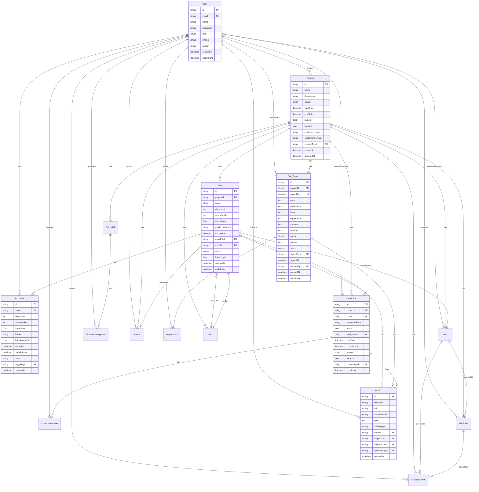
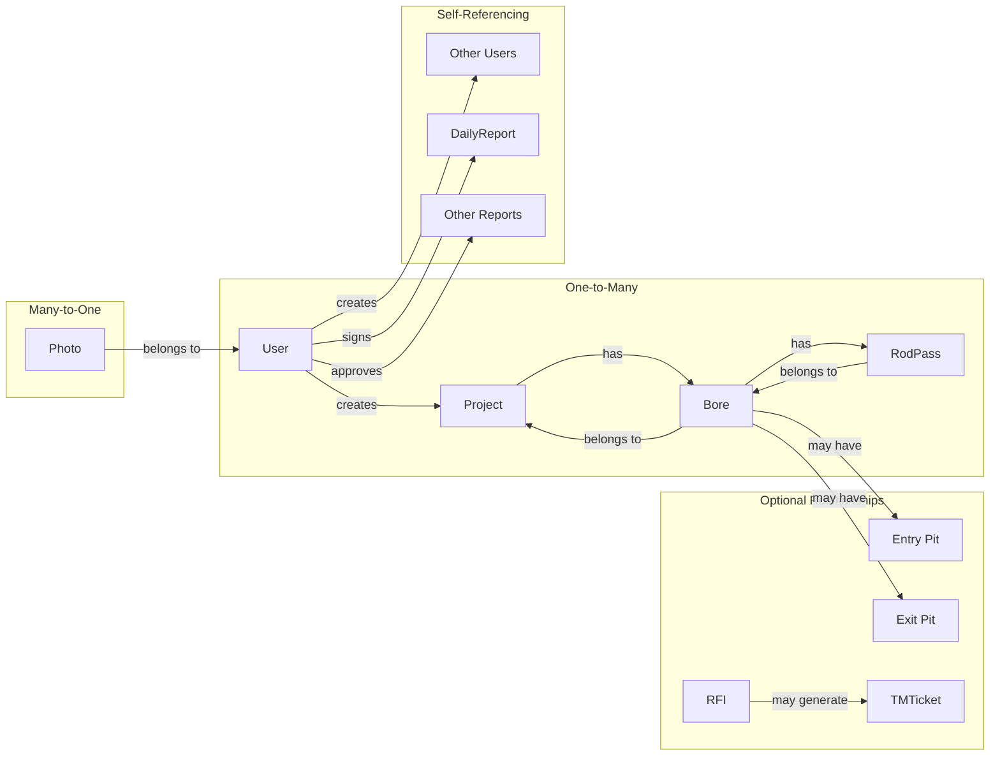
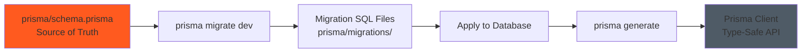

# Database Schema Documentation

**Last Updated:** 2025-11-27
**Version:** 2.0.0
**ORM:** Prisma 6.0.1
**Status:** Production Ready

---

## Table of Contents

- [Executive Summary](#executive-summary)
- [Database Overview](#database-overview)
- [Entity Relationship Diagram](#entity-relationship-diagram)
- [Core Models](#core-models)
- [HDD Operations Models](#hdd-operations-models)
- [Quality & Compliance Models](#quality--compliance-models)
- [Project Management Models](#project-management-models)
- [Cost & Estimating Models](#cost--estimating-models) (NEW)
- [Asset Models](#asset-models)
- [Relationships & Constraints](#relationships--constraints)
- [Indexes & Performance](#indexes--performance)
- [Enumerations](#enumerations)
- [Migration Strategy](#migration-strategy)
- [Query Patterns](#query-patterns)

---

## Executive Summary

The Midwest Underground database schema is designed for comprehensive HDD (Horizontal Directional Drilling) field operations management. Built with Prisma ORM, it provides type-safe database access with support for both SQLite (development) and PostgreSQL (production).

### Key Metrics

- **Total Models:** 21
- **Total Fields:** 300+
- **Relationships:** 48 foreign keys
- **Enums:** 11 types
- **Indexes:** 55+ for optimized queries
- **Migrations:** 12 applied

---

## Database Overview

```mermaid
graph TB
    subgraph "Core Layer"
        User[User<br/>Authentication & RBAC]
        Role[Role Enum<br/>OWNER, SUPER, CREW]
    end

    subgraph "Project Layer"
        Project[Project<br/>Construction Projects]
        Bore[Bore<br/>HDD Alignments]
        Pit[Pit<br/>Entry/Exit Pits]
    end

    subgraph "Operations Layer"
        RodPass[RodPass<br/>Rod-by-Rod Logs]
        DailyReport[DailyReport<br/>Field Reports]
        Event[Event<br/>Field Events]
    end

    subgraph "Quality Layer"
        Inspection[Inspection<br/>QA/QC Checks]
        CorrectiveAction[CorrectiveAction<br/>Follow-up Actions]
        Ticket811[Ticket811<br/>Locate Tickets]
        Ticket811Response[Ticket811Response<br/>Utility Responses]
    end

    subgraph "PM Layer"
        RFI[RFI<br/>Requests for Info]
        TMTicket[TMTicket<br/>T&M Tickets]
        ChangeOrder[ChangeOrder<br/>Change Orders]
    end

    subgraph "Asset Layer"
        Photo[Photo<br/>Image Management]
        ReportAudit[ReportAudit<br/>Audit Trail]
    end

    User --> Project
    User --> DailyReport
    User --> Inspection
    User --> RFI
    User --> TMTicket
    User --> ChangeOrder
    User --> Photo

    Project --> Bore
    Project --> DailyReport
    Project --> Inspection
    Project --> RFI
    Project --> TMTicket
    Project --> ChangeOrder
    Project --> Ticket811
    Project --> Event
    Project --> Pit

    Bore --> RodPass
    Bore --> Inspection
    Bore --> RFI
    Bore --> Event
    Bore --> Photo
    Bore --> Pit

    DailyReport --> ReportAudit
    DailyReport --> Photo

    Inspection --> CorrectiveAction
    Inspection --> Photo

    RFI --> TMTicket
    RFI --> ChangeOrder

    TMTicket --> ChangeOrder

    Ticket811 --> Ticket811Response

    style User fill:#FF5A1F
    style Project fill:#4F5B66
    style Bore fill:#23272A
    style DailyReport fill:#2D3748
```



---

## Entity Relationship Diagram

### Complete Schema ERD



---

## Core Models

### User

**Purpose:** Authentication and authorization with role-based access control

```prisma
model User {
  id            String    @id @default(cuid())
  email         String    @unique
  name          String?
  password      String    // bcrypt hashed
  role          Role      @default(CREW)
  phone         String?
  avatar        String?
  createdAt     DateTime  @default(now())
  updatedAt     DateTime  @updatedAt

  // Relations: 13 one-to-many relationships
  createdProjects       Project[]
  dailyReports          DailyReport[]  @relation("ReportCreator")
  signedReports         DailyReport[]  @relation("ReportSigner")
  rodPasses             RodPass[]
  inspections           Inspection[]   @relation("InspectionCreator")
  assignedInspections   Inspection[]   @relation("InspectionAssignee")
  correctiveActions     CorrectiveAction[]
  rfis                  RFI[]          @relation("RFICreator")
  rfiResponses          RFI[]          @relation("RFIResponder")
  tmTickets             TMTicket[]
  changeOrders          ChangeOrder[]
  ticket811Responses    Ticket811Response[]
  events                Event[]
  auditLogs             ReportAudit[]
  photos                Photo[]

  @@index([email])
  @@index([role])
}
```

**Key Features:**
- CUID primary keys for distributed systems
- Unique email constraint for authentication
- Password stored as bcrypt hash (never plaintext)
- Role-based access control via Role enum
- Comprehensive audit trail through relations

### Role Enum

```prisma
enum Role {
  OWNER    // Full system access, user management
  SUPER    // Manager access, approve reports
  CREW     // Field crew, submit reports
}
```

**Permission Matrix:**
- **OWNER:** All operations + user management
- **SUPER:** Create/edit projects, approve reports, view analytics
- **CREW:** Submit reports, log bores, limited analytics

---

## HDD Operations Models

### Project

**Purpose:** Top-level construction project container

```prisma
model Project {
  id                String              @id @default(cuid())
  name              String
  description       String?
  status            ProjectStatus       @default(PLANNING)
  startDate         DateTime?
  endDate           DateTime?
  budget            Float?
  location          Json?               // GeoJSON Point
  customerName      String?
  customerContact   String?
  createdAt         DateTime            @default(now())
  updatedAt         DateTime            @updatedAt
  createdById       String

  // Relations: 9 one-to-many relationships
  createdBy         User                @relation("ProjectCreator", fields: [createdById], references: [id])
  bores             Bore[]
  dailyReports      DailyReport[]
  inspections       Inspection[]
  rfis              RFI[]
  tmTickets         TMTicket[]
  changeOrders      ChangeOrder[]
  tickets811        Ticket811[]
  events            Event[]
  pits              Pit[]

  @@index([status])
  @@index([createdById])
}

enum ProjectStatus {
  PLANNING      // Pre-construction
  IN_PROGRESS   // Active work
  COMPLETED     // Finished
  ON_HOLD       // Paused
}
```

**Key Features:**
- GeoJSON location for mapping integration
- Status-based workflow tracking
- Budget tracking for financial reporting
- Customer information embedded

### Bore

**Purpose:** HDD bore alignment and drilling records

```prisma
model Bore {
  id              String        @id @default(cuid())
  projectId       String
  name            String
  alignment       Json?         // GeoJSON LineString for bore path
  depthProfile    Json?         // [{station, depth, elevation}]
  diameterIn      Float?        // Product diameter in inches
  productMaterial String?       // HDPE, PVC, Steel, etc.
  tracerWire      Boolean       @default(false)
  entryPitId      String?
  exitPitId       String?
  status          BoreStatus    @default(PLANNED)
  totalLength     Float?        // Total linear feet
  createdAt       DateTime      @default(now())
  updatedAt       DateTime      @updatedAt

  // Relations
  project         Project       @relation(fields: [projectId], references: [id], onDelete: Cascade)
  entryPit        Pit?          @relation("EntryPit", fields: [entryPitId], references: [id])
  exitPit         Pit?          @relation("ExitPit", fields: [exitPitId], references: [id])
  rodPasses       RodPass[]
  inspections     Inspection[]
  rfis            RFI[]
  events          Event[]
  photos          Photo[]

  @@index([projectId])
  @@index([status])
}

enum BoreStatus {
  PLANNED       // Design complete, not started
  IN_PROGRESS   // Currently drilling
  COMPLETED     // Finished successfully
  ABANDONED     // Discontinued
}
```

**Key Features:**
- GeoJSON LineString for 3D bore path visualization
- Depth profile for engineering analysis
- Pit relationships (entry/exit)
- Cascade delete: removing project removes bores

### RodPass

**Purpose:** Rod-by-rod drilling log (pilot, reaming passes)

```prisma
model RodPass {
  id              String    @id @default(cuid())
  boreId          String
  sequence        Int       // Rod order: 1, 2, 3...
  passNumber      Int       // 1=Pilot, 2=Ream1, 3=Ream2, etc.
  linearFeet      Float     // Length drilled this rod
  fluidMix        String?   // Drilling fluid type
  fluidVolumeGal  Float?    // Fluid volume used
  startedAt       DateTime?
  completedAt     DateTime?
  notes           String?
  loggedById      String
  createdAt       DateTime  @default(now())

  // Relations
  bore            Bore      @relation(fields: [boreId], references: [id], onDelete: Cascade)
  loggedBy        User      @relation(fields: [loggedById], references: [id])

  @@index([boreId])
  @@index([sequence])
}
```

**Key Features:**
- Sequence tracking for temporal order
- Pass number for multi-pass bores
- Fluid tracking for regulatory compliance
- Immutable once created (audit trail)

### DailyReport

**Purpose:** Daily field production reports with crew, equipment, materials

```prisma
model DailyReport {
  id              String        @id @default(cuid())
  projectId       String
  reportDate      DateTime
  crew            Json          // [{name, role, hours}]
  production      Json          @default("[]") // [{boreId, activity, lf, startTime, endTime}]
  labor           Json          @default("[]") // [{name, hours, rate, total}]
  equipment       Json          @default("[]") // [{name, hours, rate, total}]
  materials       Json          @default("[]") // [{description, qty, unit, cost, total}]
  weather         Json?         // {condition, temp, impact}
  notes           String?
  photos          Json          @default("[]") // Legacy photo references
  status          ReportStatus  @default(DRAFT)
  signedById      String?
  signedAt        DateTime?
  createdById     String
  createdAt       DateTime      @default(now())
  updatedAt       DateTime      @updatedAt

  // Relations
  project         Project       @relation(fields: [projectId], references: [id], onDelete: Cascade)
  createdBy       User          @relation("ReportCreator", fields: [createdById], references: [id])
  signedBy        User?         @relation("ReportSigner", fields: [signedById], references: [id])
  auditLogs       ReportAudit[]
  photosNew       Photo[]       // New photo management

  @@unique([projectId, reportDate])  // One report per project per day
  @@index([projectId])
  @@index([reportDate])
  @@index([status])
}

enum ReportStatus {
  DRAFT      // In progress
  SUBMITTED  // Awaiting approval
  APPROVED   // Signed off by SUPER/OWNER
  REJECTED   // Needs revision
}
```

**Key Features:**
- JSON flexibility for dynamic crew/equipment/materials
- Unique constraint: one report per project per day
- Digital signature workflow (signedById, signedAt)
- Full audit trail via ReportAudit

---

## Quality & Compliance Models

### Inspection

**Purpose:** QA/QC inspections with customizable checklists

```prisma
model Inspection {
  id              String              @id @default(cuid())
  projectId       String
  boreId          String?
  templateName    String?             // "Pre-Bore", "Mid-Bore", "Final"
  items           Json                // [{question, answer, pass/fail, notes, photo}]
  assigneeId      String?
  dueDate         DateTime?
  completedAt     DateTime?
  status          InspectionStatus    @default(OPEN)
  location        Json?               // GeoJSON Point
  createdById     String
  createdAt       DateTime            @default(now())

  // Relations
  project         Project             @relation(fields: [projectId], references: [id], onDelete: Cascade)
  bore            Bore?               @relation(fields: [boreId], references: [id], onDelete: SetNull)
  assignee        User?               @relation("InspectionAssignee", fields: [assigneeId], references: [id])
  createdBy       User                @relation("InspectionCreator", fields: [createdById], references: [id])
  correctiveActions CorrectiveAction[]
  photos          Photo[]

  @@index([projectId])
  @@index([status])
}

enum InspectionStatus {
  OPEN         // Created, not started
  IN_PROGRESS  // Work in progress
  COMPLETED    // Finished, passed
  FAILED       // Finished, failed (requires corrective action)
}
```

**Key Features:**
- Dynamic checklist via JSON items array
- Optional bore association (project-level or bore-level)
- Assignment and due date tracking
- Corrective action workflow for failed inspections

### CorrectiveAction

**Purpose:** Follow-up actions for failed inspections

```prisma
model CorrectiveAction {
  id              String    @id @default(cuid())
  inspectionId    String
  description     String
  assigneeId      String
  dueDate         DateTime
  status          CAStatus  @default(OPEN)
  resolution      String?
  closedAt        DateTime?
  createdAt       DateTime  @default(now())

  // Relations
  inspection      Inspection @relation(fields: [inspectionId], references: [id], onDelete: Cascade)
  assignee        User       @relation(fields: [assigneeId], references: [id])

  @@index([inspectionId])
  @@index([status])
}

enum CAStatus {
  OPEN         // Not started
  IN_PROGRESS  // Work in progress
  COMPLETED    // Resolved
}
```

### Ticket811 & Ticket811Response

**Purpose:** 811 locate ticket tracking and utility responses

```prisma
model Ticket811 {
  id              String              @id @default(cuid())
  projectId       String
  ticketNumber    String              // External ticket number
  ticketDate      DateTime
  expirationDate  DateTime
  status          Ticket811Status     @default(ACTIVE)
  notes           String?
  createdAt       DateTime            @default(now())
  updatedAt       DateTime            @updatedAt

  // Relations
  project         Project             @relation(fields: [projectId], references: [id], onDelete: Cascade)
  responses       Ticket811Response[]

  @@index([projectId])
  @@index([expirationDate])  // Query expiring tickets
  @@index([status])
}

enum Ticket811Status {
  ACTIVE   // Valid, not expired
  EXPIRED  // Past expiration date
  RENEWED  // Renewed after expiration
}

model Ticket811Response {
  id              String      @id @default(cuid())
  ticketId        String
  utilityName     String      // "Xcel Energy", "CenterPoint", etc.
  responseType    String?     // "Positive", "Clear", "No Conflict"
  responseDate    DateTime
  locatePhotos    Json        @default("[]")  // Photo references
  marksDescription String?
  respondedById   String
  createdAt       DateTime    @default(now())

  // Relations
  ticket          Ticket811   @relation(fields: [ticketId], references: [id], onDelete: Cascade)
  respondedBy     User        @relation(fields: [respondedById], references: [id])

  @@index([ticketId])
}
```

**Key Features:**
- Expiration tracking with automated alerts
- Multiple utility responses per ticket
- Photo documentation of utility marks
- Compliance audit trail

---

## Project Management Models

### RFI (Request for Information)

```prisma
model RFI {
  id              String      @id @default(cuid())
  projectId       String
  boreId          String?
  question        String
  location        Json?       // GeoJSON Point
  requiredBy      DateTime?
  status          RFIStatus   @default(OPEN)
  response        String?
  respondedById   String?
  respondedAt     DateTime?
  attachments     Json        @default("[]")
  createdById     String
  createdAt       DateTime    @default(now())

  // Relations
  project         Project     @relation(fields: [projectId], references: [id], onDelete: Cascade)
  bore            Bore?       @relation(fields: [boreId], references: [id], onDelete: SetNull)
  createdBy       User        @relation("RFICreator", fields: [createdById], references: [id])
  respondedBy     User?       @relation("RFIResponder", fields: [respondedById], references: [id])
  tmTickets       TMTicket[]
  changeOrders    ChangeOrder[]

  @@index([projectId])
  @@index([status])
}

enum RFIStatus {
  OPEN      // Awaiting response
  ANSWERED  // Response provided
  CLOSED    // Resolved and closed
}
```

### TMTicket (Time & Materials)

```prisma
model TMTicket {
  id              String        @id @default(cuid())
  projectId       String
  rfiId           String?
  lineItems       Json          // [{description, qty, unit, rate, total}]
  status          TMStatus      @default(DRAFT)
  approvedById    String?
  approvedAt      DateTime?
  photos          Json          @default("[]")
  signature       Json?         // {data, timestamp, name}
  createdById     String
  createdAt       DateTime      @default(now())

  // Relations
  project         Project       @relation(fields: [projectId], references: [id], onDelete: Cascade)
  rfi             RFI?          @relation(fields: [rfiId], references: [id], onDelete: SetNull)
  createdBy       User          @relation(fields: [createdById], references: [id])
  changeOrders    ChangeOrder[]

  @@index([projectId])
  @@index([status])
}

enum TMStatus {
  DRAFT      // In preparation
  SUBMITTED  // Awaiting approval
  APPROVED   // Approved for billing
  REJECTED   // Denied
}
```

### ChangeOrder

```prisma
model ChangeOrder {
  id              String      @id @default(cuid())
  projectId       String
  tmTicketId      String?
  rfiId           String?
  scope           String
  pricing         Json?
  budgetImpact    Float?
  status          COStatus    @default(PENDING)
  approvedById    String?
  approvedAt      DateTime?
  createdById     String
  createdAt       DateTime    @default(now())

  // Relations
  project         Project     @relation(fields: [projectId], references: [id], onDelete: Cascade)
  tmTicket        TMTicket?   @relation(fields: [tmTicketId], references: [id], onDelete: SetNull)
  rfi             RFI?        @relation(fields: [rfiId], references: [id], onDelete: SetNull)
  createdBy       User        @relation(fields: [createdById], references: [id])

  @@index([projectId])
  @@index([status])
}

enum COStatus {
  PENDING   // Awaiting approval
  APPROVED  // Approved, update contract
  REJECTED  // Denied
}
```

---

## Cost & Estimating Models

### CostCategory

**Purpose:** Organize cost items into logical groups for estimation

```prisma
model CostCategory {
  id          String     @id @default(cuid())
  name        String     @unique
  description String?
  createdAt   DateTime   @default(now())
  updatedAt   DateTime   @updatedAt

  // Relations
  items       CostItem[]

  @@index([name])
}
```

**Key Features:**
- Unique name constraint for preventing duplicates
- One-to-many relationship with CostItem
- Categories can include: Drilling, Equipment, Labor, Materials, etc.

### CostItem

**Purpose:** Individual cost line items with unit pricing and production rates

```prisma
model CostItem {
  id             String       @id @default(cuid())
  categoryId     String
  name           String
  description    String?
  unit           String       // LF, HR, EA, DAY, etc.
  unitCost       Float        // Cost per unit
  productionRate Float?       // Units per day (for scheduling)
  createdAt      DateTime     @default(now())
  updatedAt      DateTime     @updatedAt

  // Relations
  category       CostCategory @relation(fields: [categoryId], references: [id], onDelete: Cascade)
  estimateLines  EstimateLine[]

  @@index([categoryId])
  @@index([name])
}
```

**Key Features:**
- Linked to category for organization
- Unit types: LF (linear feet), HR (hours), EA (each), DAY (day rate)
- Production rate for HDD-specific scheduling calculations
- Cascade delete: removing category removes items

### Estimate

**Purpose:** Customer-facing project estimates with markup and tax calculations

```prisma
model Estimate {
  id             String         @id @default(cuid())
  name           String
  description    String?
  status         EstimateStatus @default(DRAFT)
  customerName   String?
  customerEmail  String?
  customerPhone  String?
  subtotal       Float          @default(0)
  markupPercent  Float          @default(0.15)  // 15% default
  markupAmount   Float          @default(0)
  taxPercent     Float          @default(0)
  taxAmount      Float          @default(0)
  total          Float          @default(0)
  validUntil     DateTime?
  notes          String?
  terms          String?
  projectId      String?
  createdById    String
  createdAt      DateTime       @default(now())
  updatedAt      DateTime       @updatedAt

  // Relations
  project        Project?       @relation(fields: [projectId], references: [id], onDelete: SetNull)
  createdBy      User           @relation(fields: [createdById], references: [id])
  lines          EstimateLine[]

  @@index([status])
  @@index([projectId])
  @@index([createdById])
}

enum EstimateStatus {
  DRAFT     // In preparation
  SENT      // Sent to customer
  APPROVED  // Customer approved
  REJECTED  // Customer rejected
  EXPIRED   // Past validUntil date
}
```

**Key Features:**
- Full customer information tracking
- Automatic calculation fields (subtotal, markup, tax, total)
- Status workflow from draft to approved/rejected
- Optional project association
- Validity tracking with expiration date

**Calculation Logic:**
1. `subtotal` = Sum of all line item `lineTotal` values
2. `markupAmount` = `subtotal` × `markupPercent`
3. `taxAmount` = (`subtotal` + `markupAmount`) × `taxPercent`
4. `total` = `subtotal` + `markupAmount` + `taxAmount`

### EstimateLine

**Purpose:** Individual line items within an estimate

```prisma
model EstimateLine {
  id          String    @id @default(cuid())
  estimateId  String
  costItemId  String?   // Optional link to catalog item
  description String
  quantity    Float
  unit        String
  unitCost    Float
  lineTotal   Float     // quantity × unitCost
  sortOrder   Int       @default(0)
  createdAt   DateTime  @default(now())
  updatedAt   DateTime  @updatedAt

  // Relations
  estimate    Estimate  @relation(fields: [estimateId], references: [id], onDelete: Cascade)
  costItem    CostItem? @relation(fields: [costItemId], references: [id], onDelete: SetNull)

  @@index([estimateId])
  @@index([costItemId])
}
```

**Key Features:**
- Optional link to cost item catalog (can also be ad-hoc entries)
- Auto-calculated lineTotal (quantity × unitCost)
- Sort order for display sequencing
- Cascade delete: removing estimate removes lines

---

## Asset Models

### Photo

**Purpose:** Centralized photo management with metadata

```prisma
model Photo {
  id            String       @id @default(cuid())
  filename      String
  url           String       // S3/local storage URL
  thumbnailUrl  String?      // Optimized thumbnail
  size          Int          // Bytes
  mimeType      String       // image/jpeg, image/png
  boreId        String?
  inspectionId  String?
  dailyReportId String?
  uploadedById  String
  createdAt     DateTime     @default(now())

  // Relations (polymorphic via optional FKs)
  bore          Bore?        @relation(fields: [boreId], references: [id], onDelete: Cascade)
  inspection    Inspection?  @relation(fields: [inspectionId], references: [id], onDelete: Cascade)
  dailyReport   DailyReport? @relation(fields: [dailyReportId], references: [id], onDelete: Cascade)
  uploadedBy    User         @relation(fields: [uploadedById], references: [id])

  @@index([boreId])
  @@index([inspectionId])
  @@index([dailyReportId])
}
```

**Key Features:**
- Polymorphic associations (bore, inspection, daily report)
- Thumbnail generation for performance
- Size tracking for storage management
- Cascade delete: removing parent removes photos

### ReportAudit

**Purpose:** Immutable audit trail for daily reports

```prisma
model ReportAudit {
  id              String      @id @default(cuid())
  reportId        String
  changedById     String
  changedAt       DateTime    @default(now())
  changes         Json        // JSON Patch format
  snapshot        Json        // Full report snapshot

  // Relations
  report          DailyReport @relation(fields: [reportId], references: [id], onDelete: Cascade)
  changedBy       User        @relation(fields: [changedById], references: [id])

  @@index([reportId])
}
```

**Key Features:**
- JSON Patch for granular change tracking
- Full snapshot for point-in-time recovery
- Immutable (never updated or deleted)
- Timestamp and user tracking

---

## Relationships & Constraints

### Relationship Types



### Cascade Behaviors

| Parent | Child | On Delete |
|--------|-------|-----------|
| Project | Bore | CASCADE |
| Project | DailyReport | CASCADE |
| Project | Inspection | CASCADE |
| Bore | RodPass | CASCADE |
| Bore | Photo | CASCADE |
| DailyReport | ReportAudit | CASCADE |
| Inspection | CorrectiveAction | CASCADE |
| Ticket811 | Ticket811Response | CASCADE |
| Bore | Inspection | SET NULL |
| RFI | TMTicket | SET NULL |
| TMTicket | ChangeOrder | SET NULL |

**Rationale:**
- **CASCADE:** Child data meaningless without parent
- **SET NULL:** Preserve child data, remove reference

---

## Indexes & Performance

### Index Strategy

```mermaid
graph TB
    subgraph "Primary Indexes"
        PK[Primary Keys<br/>@id<br/>CUID unique identifiers]
    end

    subgraph "Unique Indexes"
        UK1[User.email<br/>@unique]
        UK2[DailyReport<br/>projectId + reportDate<br/>@@unique]
    end

    subgraph "Foreign Key Indexes"
        FK1[Foreign Keys<br/>@@index boreId, projectId, etc.<br/>42 total]
    end

    subgraph "Query Optimization Indexes"
        IDX1[Status Fields<br/>@@index status<br/>Fast filtering]
        IDX2[Date Fields<br/>@@index reportDate, expirationDate<br/>Temporal queries]
        IDX3[Sequence Fields<br/>@@index sequence<br/>Ordered retrieval]
    end

    style PK fill:#FF5A1F
    style UK1 fill:#4F5B66
    style FK1 fill:#23272A
    style IDX1 fill:#FFC400
```

### Index Definitions

| Model | Index | Type | Purpose |
|-------|-------|------|---------|
| User | email | UNIQUE | Authentication lookup |
| User | role | INDEX | Role-based queries |
| Project | status | INDEX | Filter by status |
| Project | createdById | INDEX | User's projects |
| Bore | projectId | INDEX | Project's bores |
| Bore | status | INDEX | Filter by status |
| RodPass | boreId | INDEX | Bore's rod passes |
| RodPass | sequence | INDEX | Ordered retrieval |
| DailyReport | projectId | INDEX | Project's reports |
| DailyReport | reportDate | INDEX | Temporal queries |
| DailyReport | status | INDEX | Filter by status |
| DailyReport | (projectId, reportDate) | UNIQUE | One report per day |
| Ticket811 | expirationDate | INDEX | Expiration alerts |
| Photo | boreId, inspectionId, dailyReportId | INDEX | Parent lookup |

**Performance Impact:**
- Primary key lookups: O(log n)
- Foreign key joins: O(log n)
- Status filtering: O(log n)
- Date range queries: O(log n)

---

## Enumerations

### Complete Enum Definitions

```prisma
// User Roles
enum Role {
  OWNER    // Full access
  SUPER    // Manager access
  CREW     // Field crew access
}

// Project Lifecycle
enum ProjectStatus {
  PLANNING      // Pre-construction
  IN_PROGRESS   // Active work
  COMPLETED     // Finished
  ON_HOLD       // Paused
}

// Bore Lifecycle
enum BoreStatus {
  PLANNED       // Not started
  IN_PROGRESS   // Currently drilling
  COMPLETED     // Finished
  ABANDONED     // Discontinued
}

// Report Approval Workflow
enum ReportStatus {
  DRAFT      // In progress
  SUBMITTED  // Awaiting approval
  APPROVED   // Approved
  REJECTED   // Needs revision
}

// Inspection Workflow
enum InspectionStatus {
  OPEN         // Not started
  IN_PROGRESS  // In progress
  COMPLETED    // Passed
  FAILED       // Failed
}

// Corrective Action Status
enum CAStatus {
  OPEN         // Not started
  IN_PROGRESS  // In progress
  COMPLETED    // Resolved
}

// RFI Workflow
enum RFIStatus {
  OPEN      // Awaiting response
  ANSWERED  // Response provided
  CLOSED    // Resolved
}

// T&M Approval
enum TMStatus {
  DRAFT      // In preparation
  SUBMITTED  // Awaiting approval
  APPROVED   // Approved
  REJECTED   // Denied
}

// Change Order Approval
enum COStatus {
  PENDING   // Awaiting approval
  APPROVED  // Approved
  REJECTED  // Denied
}

// 811 Ticket Lifecycle
enum Ticket811Status {
  ACTIVE   // Valid
  EXPIRED  // Past expiration
  RENEWED  // Renewed
}

// Estimate Workflow
enum EstimateStatus {
  DRAFT     // In preparation
  SENT      // Sent to customer
  APPROVED  // Customer approved
  REJECTED  // Customer rejected
  EXPIRED   // Past validity date
}
```

---

## Migration Strategy

### Migration Workflow



### Migration Commands

```bash
# Development workflow
npx prisma migrate dev --name add-bore-status

# Production workflow
npx prisma migrate deploy

# Reset database (dev only)
npx prisma migrate reset

# Generate Prisma Client
npx prisma generate

# Open database GUI
npx prisma studio
```

### Migration History

12 migrations applied (as of 2025-11-27):

1. `init` - Initial schema
2. `add-bore-status` - Add bore status tracking
3. `add-rod-passes` - Rod-by-rod logging
4. `add-daily-reports` - Daily field reports
5. `add-inspections` - QA/QC inspections
6. `add-rfis` - Request for information
7. `add-tm-tickets` - Time & materials
8. `add-change-orders` - Change order tracking
9. `add-811-tickets` - 811 compliance
10. `add-photos` - Photo management
11. `add-pits` - Entry/exit pit tracking
12. `add-cost-estimating` - Cost categories, items, estimates, and line items (NEW)

---

## Query Patterns

### Common Query Examples

```typescript
// Get all active projects with bores
const projects = await prisma.project.findMany({
  where: { status: 'IN_PROGRESS' },
  include: {
    bores: {
      include: {
        rodPasses: true
      }
    },
    dailyReports: {
      where: { status: 'APPROVED' },
      orderBy: { reportDate: 'desc' }
    }
  }
});

// Get daily report with full audit trail
const report = await prisma.dailyReport.findUnique({
  where: { id: reportId },
  include: {
    project: true,
    createdBy: { select: { name: true, email: true } },
    signedBy: { select: { name: true, email: true } },
    auditLogs: {
      orderBy: { changedAt: 'desc' },
      include: { changedBy: { select: { name: true } } }
    },
    photosNew: true
  }
});

// Get expiring 811 tickets (next 7 days)
const expiringTickets = await prisma.ticket811.findMany({
  where: {
    expirationDate: {
      gte: new Date(),
      lte: new Date(Date.now() + 7 * 24 * 60 * 60 * 1000)
    },
    status: 'ACTIVE'
  },
  include: {
    project: true,
    responses: true
  },
  orderBy: { expirationDate: 'asc' }
});

// Get user's assigned inspections
const inspections = await prisma.inspection.findMany({
  where: {
    assigneeId: userId,
    status: { in: ['OPEN', 'IN_PROGRESS'] }
  },
  include: {
    project: { select: { name: true } },
    bore: { select: { name: true } },
    correctiveActions: {
      where: { status: { not: 'COMPLETED' } }
    }
  },
  orderBy: { dueDate: 'asc' }
});
```

---

## Related Documentation

- [Architecture Overview](./OVERVIEW.md) - System architecture
- [API Reference](./API-REFERENCE.md) - API endpoints
- [Architectural Decisions](./DECISIONS.md) - ADR for database choices
- [Development Guide](../guides/DEVELOPMENT.md) - Database setup
- [Testing Guide](../guides/TESTING.md) - Database testing

---

## References

- [Prisma ORM Documentation](https://www.prisma.io/docs)
- [Prisma Schema Reference](https://www.prisma.io/docs/reference/api-reference/prisma-schema-reference)
- [PostgreSQL Documentation](https://www.postgresql.org/docs/)
- [Database Design Best Practices](https://www.freecodecamp.org/news/database-design-best-practices/)

---

**Document Version:** 2.1.0
**Last Updated:** 2025-11-28
**Maintained By:** @nice-and-precise
