# Architectural Decision Records

**Last Updated:** 2025-11-23
**Version:** 1.0.0
**Format:** Michael Nygard ADR Template

---

## Table of Contents

- [Overview](#overview)
- [ADR Index](#adr-index)
- [ADR-001: Next.js 15 App Router](#adr-001-nextjs-15-app-router)
- [ADR-002: Prisma ORM for Database Access](#adr-002-prisma-orm-for-database-access)
- [ADR-003: NextAuth v5 for Authentication](#adr-003-nextauth-v5-for-authentication)
- [ADR-004: SQLite for Development, PostgreSQL for Production](#adr-004-sqlite-for-development-postgresql-for-production)
- [ADR-005: Monorepo Structure](#adr-005-monorepo-structure)
- [ADR-006: TypeScript Strict Mode](#adr-006-typescript-strict-mode)
- [ADR-007: Vitest + Playwright Testing Stack](#adr-007-vitest--playwright-testing-stack)
- [ADR-008: Tailwind CSS for Styling](#adr-008-tailwind-css-for-styling)
- [ADR-009: Role-Based Access Control (RBAC)](#adr-009-role-based-access-control-rbac)
- [ADR-010: JSON for Flexible Schema Fields](#adr-010-json-for-flexible-schema-fields)
- [ADR-011: Hybrid Static + Next.js Deployment](#adr-011-hybrid-static--nextjs-deployment)

---

## Overview

This document captures the major architectural decisions made for the Midwest Underground Website project. Each decision record follows the Michael Nygard format, documenting the context, decision, and consequences.

### Decision Process

```mermaid
graph LR
    Problem[Problem/Need<br/>Identified] --> Research[Research<br/>Alternatives]
    Research --> Evaluate[Evaluate<br/>Trade-offs]
    Evaluate --> Decide[Make<br/>Decision]
    Decide --> Document[Document<br/>ADR]
    Document --> Implement[Implement<br/>Decision]
    Implement --> Review[Periodic<br/>Review]

    style Problem fill:#FF5A1F
    style Decide fill:#4F5B66
    style Document fill:#23272A
```

### ADR Status Definitions

- **Proposed** - Under consideration
- **Accepted** - Decision made, being implemented
- **Superseded** - Replaced by a newer decision
- **Deprecated** - No longer recommended but still in use
- **Rejected** - Considered but not accepted

---

## ADR Index

| ID | Title | Status | Date | Supersedes |
|----|-------|--------|------|------------|
| 001 | Next.js 15 App Router | Accepted | 2025-01-10 | - |
| 002 | Prisma ORM for Database Access | Accepted | 2025-01-10 | - |
| 003 | NextAuth v5 for Authentication | Accepted | 2025-01-10 | - |
| 004 | SQLite for Dev, PostgreSQL for Prod | Accepted | 2025-01-10 | - |
| 005 | Monorepo Structure | Accepted | 2025-01-12 | - |
| 006 | TypeScript Strict Mode | Accepted | 2025-01-12 | - |
| 007 | Vitest + Playwright Testing Stack | Accepted | 2025-01-15 | - |
| 008 | Tailwind CSS for Styling | Accepted | 2025-01-15 | - |
| 009 | Role-Based Access Control (RBAC) | Accepted | 2025-01-18 | - |
| 010 | JSON for Flexible Schema Fields | Accepted | 2025-01-20 | - |
| 011 | Hybrid Static + Next.js Deployment | Accepted | 2025-01-22 | - |

---

## ADR-001: Next.js 15 App Router

### Status
**Accepted** (2025-01-10)

### Context

Midwest Underground needs a modern web platform for HDD field operations management. The system must support:
- Server-side rendering for SEO and performance
- Real-time dashboard updates for field crews
- Mobile-responsive UI for on-site use
- API-first architecture for future mobile apps
- Scalable deployment with minimal DevOps overhead

We evaluated three frameworks:
1. **Next.js 15 (App Router)** - Full-stack React framework with RSC
2. **Remix** - React framework with nested routing
3. **SvelteKit** - Lightweight full-stack framework

### Decision

We will use **Next.js 15 with the App Router** as the primary application framework.

**Rationale:**
- **React Server Components (RSC)** - Reduce client-side JavaScript, faster page loads
- **Built-in API Routes** - Serverless functions for backend logic
- **File-based Routing** - Intuitive project structure
- **Vercel Deployment** - Zero-config production deployment
- **Large Ecosystem** - Mature tooling, extensive community support
- **Incremental Adoption** - Can coexist with legacy static HTML

### Consequences

**Positive:**
- Fast development velocity with Next.js conventions
- Excellent TypeScript integration out of the box
- Automatic code splitting and optimization
- Strong documentation and community resources
- Easy integration with Prisma, NextAuth, Tailwind

**Negative:**
- Learning curve for App Router (newer paradigm)
- Increased build complexity vs. static site
- Vendor lock-in to Vercel ecosystem (mitigated by self-hosting option)
- Bundle size larger than minimal frameworks

**Mitigation:**
- Comprehensive developer documentation ([DEVELOPMENT.md](../guides/DEVELOPMENT.md))
- Gradual migration strategy (hybrid deployment)
- Automated testing to catch App Router gotchas

---

## ADR-002: Prisma ORM for Database Access

### Status
**Accepted** (2025-01-10)

### Context

The application requires a robust database layer for managing HDD operations data (projects, bores, daily reports, etc.). We need:
- Type-safe database queries
- Schema migration management
- Support for both SQLite (dev) and PostgreSQL (prod)
- Good developer experience

Alternatives considered:
1. **Prisma ORM** - Modern type-safe ORM
2. **Drizzle ORM** - Lightweight SQL-first ORM
3. **TypeORM** - Mature ORM with decorator syntax
4. **Kysely** - Type-safe SQL query builder

### Decision

We will use **Prisma ORM** for all database access.

**Rationale:**
- **End-to-End Type Safety** - Generated types from schema
- **Prisma Migrate** - Declarative schema migrations
- **Prisma Studio** - Built-in database GUI for development
- **Multi-Database Support** - SQLite (dev) → PostgreSQL (prod) with same API
- **Excellent DX** - Autocomplete, inline documentation
- **Next.js Integration** - Official Next.js examples and best practices

### Consequences

**Positive:**
- Compile-time error detection for database queries
- Reduced runtime errors from type mismatches
- Clear schema definition in `schema.prisma`
- Easy onboarding for new developers
- Migration history tracked in Git

**Negative:**
- Performance overhead vs. raw SQL for complex queries
- Generated client increases project size
- Migration rollbacks require manual intervention
- Limited support for advanced PostgreSQL features

**Mitigation:**
- Use raw SQL queries (`prisma.$queryRaw`) for performance-critical paths
- Optimize Prisma Client generation in CI/CD
- Document migration workflow ([DATABASE-SCHEMA.md](./DATABASE-SCHEMA.md))

---

## ADR-003: NextAuth v5 for Authentication

### Status
**Accepted** (2025-01-10)

### Context

Field operations require role-based access control (RBAC):
- **OWNER** - Full system access
- **SUPER** - Manager access (approve reports, create projects)
- **CREW** - Field access (submit reports, log bores)

Security requirements:
- Secure password storage (bcrypt)
- Session management with httpOnly cookies
- Protection against CSRF attacks
- Easy integration with Next.js

Alternatives:
1. **NextAuth v5 (Auth.js)** - Next.js-native auth library
2. **Clerk** - Managed auth service
3. **Auth0** - Enterprise auth service
4. **Custom JWT solution** - Build from scratch

### Decision

We will use **NextAuth v5 (Auth.js)** with Credentials provider.

**Rationale:**
- **Native Next.js Integration** - Designed for Next.js App Router
- **Session Management** - httpOnly cookies, CSRF protection
- **Flexible Providers** - Credentials provider for email/password
- **Type Safety** - Full TypeScript support
- **Free & Open Source** - No per-user pricing
- **Database Sessions** - Store sessions in Prisma database

### Consequences

**Positive:**
- Secure by default (httpOnly cookies, CSRF tokens)
- Easy role-based authorization in API routes
- Session persistence across server restarts
- No external dependencies or pricing tiers
- Consistent with Next.js ecosystem

**Negative:**
- Beta version (v5) - potential breaking changes
- Limited built-in UI components
- Requires custom login page
- Complex configuration for advanced use cases

**Mitigation:**
- Pin to specific v5 beta version
- Create custom `LoginForm` component
- Document authentication flow ([DEVELOPMENT.md](../guides/DEVELOPMENT.md))

---

## ADR-004: SQLite for Development, PostgreSQL for Production

### Status
**Accepted** (2025-01-10)

### Context

Development teams need a fast local database setup without external dependencies. Production requires a robust, scalable relational database.

Requirements:
- Fast local development (no Docker required)
- Production-grade reliability and scalability
- Consistent schema across environments
- Easy backup and restoration

Alternatives:
1. **SQLite (dev) → PostgreSQL (prod)** - Different databases per environment
2. **PostgreSQL everywhere** - Same database in all environments
3. **MySQL everywhere** - Alternative RDBMS
4. **MongoDB** - NoSQL alternative

### Decision

We will use **SQLite for development** and **PostgreSQL for production**.

**Rationale:**
- **Zero Config Dev Setup** - SQLite runs in-process, no installation needed
- **Fast Iteration** - Instant schema changes with `prisma db push`
- **Production Ready** - PostgreSQL proven for HDD operations scale
- **Prisma Abstraction** - Same API works for both databases
- **Cost Effective** - Free SQLite for dev, managed Postgres for prod (Vercel/Supabase)

### Consequences

**Positive:**
- New developers can start coding immediately (no DB setup)
- Fast test execution with in-memory SQLite
- Production database (PostgreSQL) optimized for performance
- Easy schema parity with Prisma migrations

**Negative:**
- Potential subtle differences between SQLite and PostgreSQL
- Must test production migrations against PostgreSQL
- Cannot use PostgreSQL-specific features in development

**Mitigation:**
- CI/CD runs tests against both SQLite and PostgreSQL
- Use Prisma-supported features only
- Document database setup ([DEVELOPMENT.md](../guides/DEVELOPMENT.md))

---

## ADR-005: Monorepo Structure

### Status
**Accepted** (2025-01-12)

### Context

The project consists of:
- Legacy static HTML dashboard (9 pages)
- Next.js application (migration in progress)
- Shared assets (images, fonts, styles)
- Documentation
- Testing infrastructure

We need a clear project structure that:
- Supports gradual migration from static to Next.js
- Shares assets between static and Next.js
- Maintains clear separation of concerns

Alternatives:
1. **Monorepo** - Single repository with multiple "apps"
2. **Multi-repo** - Separate repositories for static and Next.js
3. **Turborepo** - Monorepo with build orchestration

### Decision

We will use a **monorepo structure** with `public/` for static assets and `src/` for Next.js.

**Rationale:**
- **Hybrid Deployment** - Static dashboard + Next.js coexist
- **Asset Sharing** - Single source for images, fonts, styles
- **Simplified Workflow** - One repository to clone, one CI/CD pipeline
- **Gradual Migration** - Pages migrate from static to Next.js incrementally
- **Clear Boundaries** - `public/dashboard/` (static) vs. `src/app/` (Next.js)

### Consequences

**Positive:**
- Easy asset reuse between static and Next.js
- Single Git repository for all code
- Unified documentation
- Simplified deployment (single Docker container)

**Negative:**
- Larger repository size
- Risk of tight coupling between static and Next.js code
- Complex build process (two "apps" in one repo)

**Mitigation:**
- Clear directory structure documented in [README.md](../../README.md)
- Separate build scripts for static and Next.js
- Use `public/` for truly static assets only

---

## ADR-006: TypeScript Strict Mode

### Status
**Accepted** (2025-01-12)

### Context

The codebase needs strong type safety to prevent runtime errors in field operations. HDD data is critical (bore alignments, daily reports, 811 compliance).

Options:
1. **TypeScript Strict Mode** - Maximum type safety
2. **TypeScript with partial checks** - Gradual typing
3. **JavaScript with JSDoc** - No compilation step

### Decision

We will enable **TypeScript strict mode** for the entire codebase.

**Rationale:**
- **Catch Errors Early** - Null/undefined checks at compile time
- **Better IDE Support** - Accurate autocomplete and refactoring
- **Self-Documenting Code** - Types serve as inline documentation
- **Prisma Integration** - Generated types are fully strict
- **Industry Standard** - Aligns with Next.js and Prisma best practices

### Consequences

**Positive:**
- Fewer runtime errors in production
- Safer refactoring (compiler catches breaking changes)
- Improved developer experience (IntelliSense, go-to-definition)
- Higher code quality standards

**Negative:**
- Steeper learning curve for JavaScript developers
- More verbose code (type annotations)
- Slower initial development (must satisfy type checker)

**Mitigation:**
- Provide TypeScript training resources
- Use type inference where possible (reduce verbosity)
- Document common patterns ([DEVELOPMENT.md](../guides/DEVELOPMENT.md))

---

## ADR-007: Vitest + Playwright Testing Stack

### Status
**Accepted** (2025-01-15)

### Context

The application requires comprehensive testing to ensure field operation reliability:
- Unit tests for business logic (KPI calculations, validations)
- Integration tests for API routes
- E2E tests for critical workflows (bore logging, report approval)

Requirements:
- Fast test execution (developer feedback loop)
- TypeScript support
- Next.js compatibility
- Browser automation for E2E

Alternatives:
1. **Vitest + Playwright** - Modern, fast testing stack
2. **Jest + Cypress** - Mature, widely adopted
3. **Jest + Puppeteer** - Alternative browser automation

### Decision

We will use **Vitest for unit/integration tests** and **Playwright for E2E tests**.

**Rationale:**
- **Vitest** - Fastest unit test runner, native ESM support, Vite-powered
- **Playwright** - Cross-browser E2E testing (Chromium, Firefox, WebKit)
- **TypeScript First** - Both support TypeScript out of the box
- **Modern Tooling** - Better DX than Jest/Cypress
- **Next.js Compatible** - Official Next.js testing examples

### Consequences

**Positive:**
- Extremely fast unit test execution (parallel, cached)
- Reliable E2E tests (auto-wait, retry logic)
- Single TypeScript config for all tests
- Browser screenshots/videos for debugging E2E failures

**Negative:**
- Less mature than Jest ecosystem
- Smaller community (fewer Stack Overflow answers)
- Playwright heavier than Cypress (downloads browsers)

**Mitigation:**
- Document testing patterns ([TESTING.md](../guides/TESTING.md))
- Use Playwright Docker image in CI/CD
- Leverage official Vitest and Playwright docs

---

## ADR-008: Tailwind CSS for Styling

### Status
**Accepted** (2025-01-15)

### Context

The UI must be:
- Mobile-responsive for field use
- Consistent with brand colors (Charcoal, Safety Orange)
- Dark mode support for night operations
- Fast iteration without CSS file bloat

Alternatives:
1. **Tailwind CSS** - Utility-first CSS framework
2. **CSS Modules** - Scoped CSS per component
3. **Styled Components** - CSS-in-JS
4. **Vanilla CSS** - Traditional stylesheets

### Decision

We will use **Tailwind CSS** for all styling.

**Rationale:**
- **Utility-First** - Rapid prototyping with pre-defined classes
- **Tree-Shaking** - Unused classes purged in production
- **Dark Mode Built-In** - `dark:` variants for theme switching
- **Responsive Design** - Mobile-first breakpoints (`sm:`, `md:`, `lg:`)
- **Next.js Integration** - Zero-config setup with Next.js
- **Consistency** - Custom colors in `tailwind.config.js`

### Consequences

**Positive:**
- Faster UI development (no CSS file switching)
- Smaller CSS bundle (only used classes shipped)
- Built-in dark mode and responsive utilities
- Easy theming with CSS variables

**Negative:**
- HTML can become verbose (many utility classes)
- Learning curve for CSS-first developers
- Requires PostCSS build step

**Mitigation:**
- Use `@apply` for complex component styles
- Document brand colors ([BRAND-STANDARDS.md](../brand/BRAND-STANDARDS.md))
- Leverage Tailwind IntelliSense extension

---

## ADR-009: Role-Based Access Control (RBAC)

### Status
**Accepted** (2025-01-18)

### Context

Field operations have distinct roles with different permissions:
- **OWNER** - Business owner, full access
- **SUPER** - Project managers, approve reports
- **CREW** - Field workers, submit reports

We need a security model that:
- Enforces permissions at API level
- Prevents unauthorized data access
- Scales as more roles are added

Alternatives:
1. **Role-Based Access Control (RBAC)** - Fixed roles with permissions
2. **Attribute-Based Access Control (ABAC)** - Dynamic policies
3. **No Authorization** - All authenticated users have full access

### Decision

We will implement **Role-Based Access Control (RBAC)** with three roles: OWNER, SUPER, CREW.

**Rationale:**
- **Simple Model** - Easy to understand and implement
- **Database-Backed** - Roles stored in `User` model
- **NextAuth Integration** - Role included in session JWT
- **Sufficient Granularity** - Three roles cover current needs
- **Future-Proof** - Can add more roles as needed

### Consequences

**Positive:**
- Clear permission boundaries
- Easy to audit user access
- Role checked in every API route
- Single source of truth (database)

**Negative:**
- Less flexible than ABAC (cannot express complex policies)
- Adding new roles requires database migration
- Cannot grant temporary permissions

**Mitigation:**
- Document permission matrix ([OVERVIEW.md](./OVERVIEW.md))
- Create reusable authorization middleware
- Plan for future migration to ABAC if needed

---

## ADR-010: JSON for Flexible Schema Fields

### Status
**Accepted** (2025-01-20)

### Context

Daily reports and inspections have highly variable structure:
- **Crew members** - Dynamic array (varies by day)
- **Equipment used** - Different equipment per project
- **Inspection checklists** - Custom templates per project

We need flexibility without constant schema migrations.

Alternatives:
1. **JSON Fields** - Store structured data as JSON
2. **Normalized Tables** - Separate tables (CrewMember, EquipmentUsage)
3. **JSONB (PostgreSQL only)** - Indexed JSON
4. **NoSQL Database** - MongoDB for flexible schema

### Decision

We will use **JSON fields** for dynamic data (crew, equipment, inspection items).

**Rationale:**
- **Schema Flexibility** - No migrations for checklist changes
- **Prisma Support** - `Json` type works in SQLite and PostgreSQL
- **Simple Queries** - Fetch entire report in one query
- **Version Control** - JSON changes tracked in Git (templates)
- **Performance** - Acceptable for read-heavy workloads

### Consequences

**Positive:**
- No migrations when checklist templates change
- Easy to add custom fields per project
- Simple data model (fewer tables)
- JSON can be validated with Zod at runtime

**Negative:**
- Cannot query inside JSON with indexes (in SQLite)
- Type safety lost inside JSON (runtime validation needed)
- Harder to aggregate across all crew members
- Migration to PostgreSQL JSONB in future for indexing

**Mitigation:**
- Use Zod schemas for JSON validation
- Document JSON structure ([DATABASE-SCHEMA.md](./DATABASE-SCHEMA.md))
- Plan migration to JSONB when production load requires indexing

---

## ADR-011: Hybrid Static + Next.js Deployment

### Status
**Accepted** (2025-01-22)

### Context

The project started as a static HTML dashboard (9 pages) and is gradually migrating to Next.js. We need a deployment strategy that:
- Keeps static pages live during migration
- Allows incremental Next.js adoption
- Minimizes downtime during cutover
- Supports both static and dynamic content

Alternatives:
1. **Hybrid Deployment** - Static pages + Next.js coexist
2. **Big Bang Migration** - Rewrite all pages, deploy at once
3. **Parallel Deployment** - Two separate sites (static.example.com, app.example.com)

### Decision

We will deploy a **hybrid static + Next.js application** on Vercel/Netlify.

**Rationale:**
- **Zero Downtime** - Static pages remain functional during migration
- **Incremental Migration** - Migrate page-by-page at our own pace
- **Shared Assets** - Images, fonts served from `public/`
- **Single Domain** - No user confusion from multiple URLs
- **Next.js Built-In** - `public/` folder serves static files automatically

### Consequences

**Positive:**
- Low-risk migration strategy (fail-safe fallback)
- Can measure Next.js page performance before full cutover
- Users don't notice migration happening
- Easy rollback (revert to static if issues)

**Negative:**
- Larger deployment bundle (both static and Next.js)
- Routing complexity (static vs. Next.js routes)
- Need to maintain both codebases temporarily

**Mitigation:**
- Document migration plan ([DEPLOYMENT.md](../guides/DEPLOYMENT.md))
- Set clear timeline for static page deprecation
- Use feature flags to test Next.js pages before public launch

---

## Related Documentation

- [Architecture Overview](./OVERVIEW.md) - System architecture
- [Database Schema](./DATABASE-SCHEMA.md) - Database design
- [API Reference](./API-REFERENCE.md) - API design patterns
- [Development Guide](../guides/DEVELOPMENT.md) - Implementation details
- [Testing Guide](../guides/TESTING.md) - Testing decisions

---

## References

ADR format and best practices:
- [Architectural Decision Records](https://adr.github.io/)
- [Michael Nygard ADR Template](https://github.com/joelparkerhenderson/architecture-decision-record/blob/main/locales/en/templates/decision-record-template-by-michael-nygard/index.md)
- [AWS ADR Process](https://docs.aws.amazon.com/prescriptive-guidance/latest/architectural-decision-records/adr-process.html)
- [ADR Templates](https://adr.github.io/adr-templates/)

---

**Document Version:** 1.0.0
**Last Updated:** 2025-11-23
**Total ADRs:** 11
**Maintained By:** @nice-and-precise
