# System Architecture Overview

**Last Updated:** 2025-11-23
**Version:** 1.0.0
**Status:** Production Ready

---

## Table of Contents

- [Executive Summary](#executive-summary)
- [System Architecture](#system-architecture)
- [Technology Stack](#technology-stack)
- [Request Flow](#request-flow)
- [Component Architecture](#component-architecture)
- [API Layer](#api-layer)
- [Database Layer](#database-layer)
- [Authentication & Authorization](#authentication--authorization)
- [State Management](#state-management)
- [Styling & Theming](#styling--theming)
- [File Structure](#file-structure)
- [Deployment Architecture](#deployment-architecture)

---

## Executive Summary

Midwest Underground Website is a **hybrid full-stack web application** designed for HDD (Horizontal Directional Drilling) field operations management. The system combines a legacy static dashboard with a modern Next.js 15 application, providing comprehensive project management, bore logging, field reporting, and 811 compliance tracking.

### Key Characteristics

- **Architecture Pattern:** Full-stack monolith with API-first design
- **Rendering Strategy:** Server-Side Rendering (SSR) with Client Components where needed
- **Database Strategy:** Prisma ORM with SQLite (dev) → PostgreSQL (production)
- **Authentication:** NextAuth v5 with role-based access control (RBAC)
- **Deployment:** Hybrid static + Next.js deployment on Vercel/Netlify

---

## System Architecture

```mermaid
graph TB
    subgraph "Client Layer"
        Browser[Web Browser]
        Mobile[Mobile Device]
    end

    subgraph "Presentation Layer - Next.js 15"
        Static[Static Pages<br/>HTML/CSS/JS]
        AppRouter[App Router<br/>React Server Components]
        ClientComp[Client Components<br/>Interactive UI]
    end

    subgraph "API Layer - Next.js API Routes"
        AuthAPI[Auth Routes<br/>/api/auth/*]
        ProjectAPI[Project API<br/>/api/projects/*]
        BoreAPI[Bore Logs API<br/>/api/bore-logs/*]
        HDDAPI[HDD Operations API<br/>/api/hdd/*]
        PhotoAPI[Photo Management<br/>/api/photos/*]
        KPIAPI[Analytics API<br/>/api/kpis/*]
    end

    subgraph "Business Logic Layer"
        AuthService[Auth Service<br/>NextAuth v5]
        KPIService[KPI Service<br/>Analytics Engine]
        ValidationService[Validation Layer<br/>Zod Schemas]
        OfflineSync[Offline Sync<br/>Service Worker]
    end

    subgraph "Data Access Layer"
        PrismaClient[Prisma Client<br/>ORM]
        PhotoStorage[Photo Storage<br/>Local/Cloud]
    end

    subgraph "Data Layer"
        SQLite[(SQLite Database<br/>Development)]
        PostgreSQL[(PostgreSQL<br/>Production)]
        FileSystem[File System<br/>Photo Storage]
    end

    Browser --> Static
    Mobile --> Static
    Browser --> AppRouter
    Mobile --> AppRouter
    AppRouter --> ClientComp

    Static --> AuthAPI
    ClientComp --> AuthAPI
    ClientComp --> ProjectAPI
    ClientComp --> BoreAPI
    ClientComp --> HDDAPI
    ClientComp --> PhotoAPI
    ClientComp --> KPIAPI

    AuthAPI --> AuthService
    ProjectAPI --> ValidationService
    BoreAPI --> ValidationService
    HDDAPI --> ValidationService
    KPIAPI --> KPIService

    AuthService --> PrismaClient
    KPIService --> PrismaClient
    ValidationService --> PrismaClient
    PhotoAPI --> PhotoStorage

    PrismaClient --> SQLite
    PrismaClient --> PostgreSQL
    PhotoStorage --> FileSystem

    style Browser fill:#4A90E2
    style Mobile fill:#4A90E2
    style AppRouter fill:#FF5A1F
    style PrismaClient fill:#2D3748
    style PostgreSQL fill:#336791
```

### Architecture Principles

1. **API-First Design** - All data operations flow through RESTful API endpoints
2. **Progressive Enhancement** - Static HTML fallback with JavaScript enhancements
3. **Zero-Trust Security** - Authentication required for all protected routes
4. **Offline-First** - Service worker enables offline field data collection
5. **Type Safety** - End-to-end TypeScript with Zod runtime validation

---

## Technology Stack

```mermaid
graph LR
    subgraph "Frontend Stack"
        NextJS[Next.js 15.0.3<br/>App Router]
        React[React 18.3.1<br/>Server + Client]
        TypeScript[TypeScript 5.x<br/>Type Safety]
        Tailwind[Tailwind CSS 3.4.1<br/>Utility-First CSS]
    end

    subgraph "Backend Stack"
        API[Next.js API Routes<br/>Serverless Functions]
        Prisma[Prisma ORM 6.0.1<br/>Type-Safe Database]
        NextAuth[NextAuth v5<br/>Auth.js]
        Zod[Zod Validation<br/>Runtime Safety]
    end

    subgraph "Database Stack"
        SQLite[(SQLite<br/>Development)]
        PostgreSQL[(PostgreSQL<br/>Production)]
    end

    subgraph "Testing Stack"
        Vitest[Vitest 4.0.13<br/>Unit Tests]
        Playwright[Playwright 1.56.1<br/>E2E Tests]
    end

    subgraph "DevOps Stack"
        Git[Git + GitHub<br/>Version Control]
        Vercel[Vercel<br/>Deployment]
        Prisma_Studio[Prisma Studio<br/>Database GUI]
    end

    NextJS --> React
    React --> TypeScript
    TypeScript --> Tailwind

    API --> NextAuth
    API --> Prisma
    API --> Zod

    Prisma --> SQLite
    Prisma --> PostgreSQL

    style NextJS fill:#FF5A1F
    style React fill:#61DAFB
    style Prisma fill:#2D3748
    style PostgreSQL fill:#336791
```

### Version Matrix

| Category | Technology | Version | Purpose |
|----------|-----------|---------|---------|
| **Framework** | Next.js | 15.0.3 | Full-stack React framework |
| **UI Library** | React | 18.3.1 | Component-based UI |
| **Language** | TypeScript | 5.x | Type safety |
| **Styling** | Tailwind CSS | 3.4.1 | Utility-first styling |
| **ORM** | Prisma | 6.0.1 | Database abstraction |
| **Authentication** | NextAuth | 5.0.0-beta.29 | Auth.js v5 |
| **Validation** | Zod | 3.25.76 | Schema validation |
| **Charts** | Chart.js | 4.4.7 | Data visualization |
| **Unit Testing** | Vitest | 4.0.13 | Fast unit tests |
| **E2E Testing** | Playwright | 1.56.1 | Browser automation |

---

## Request Flow

### Server-Side Rendering (SSR) Flow

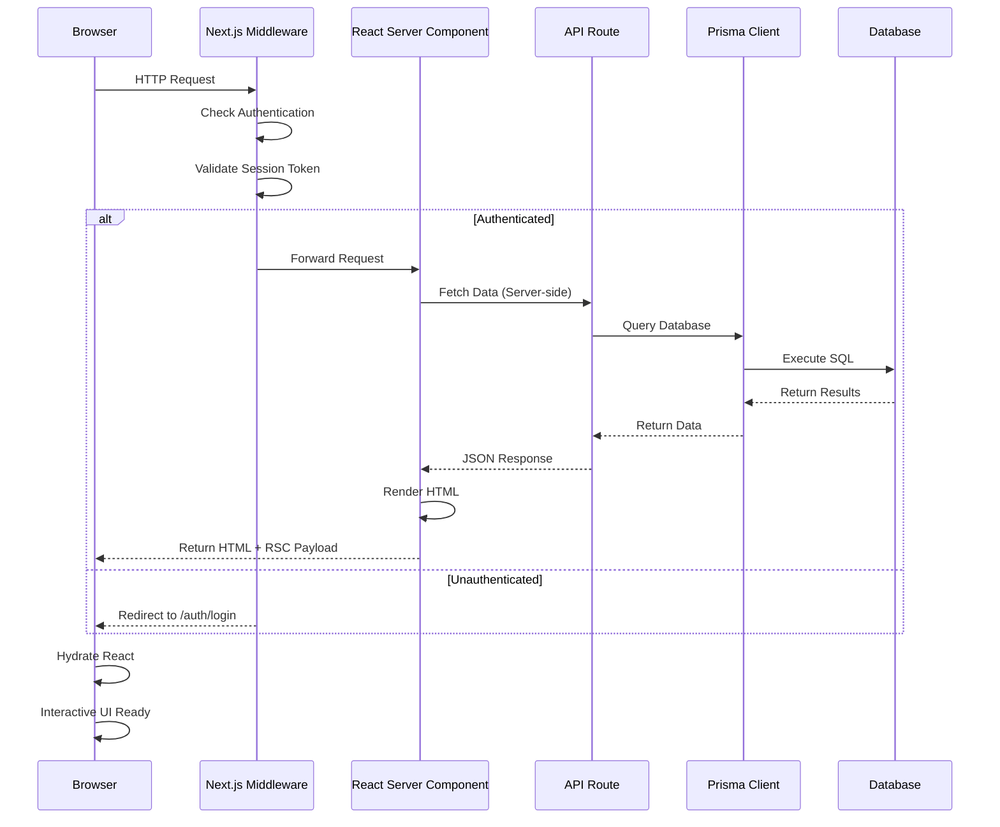

### Client-Side API Call Flow

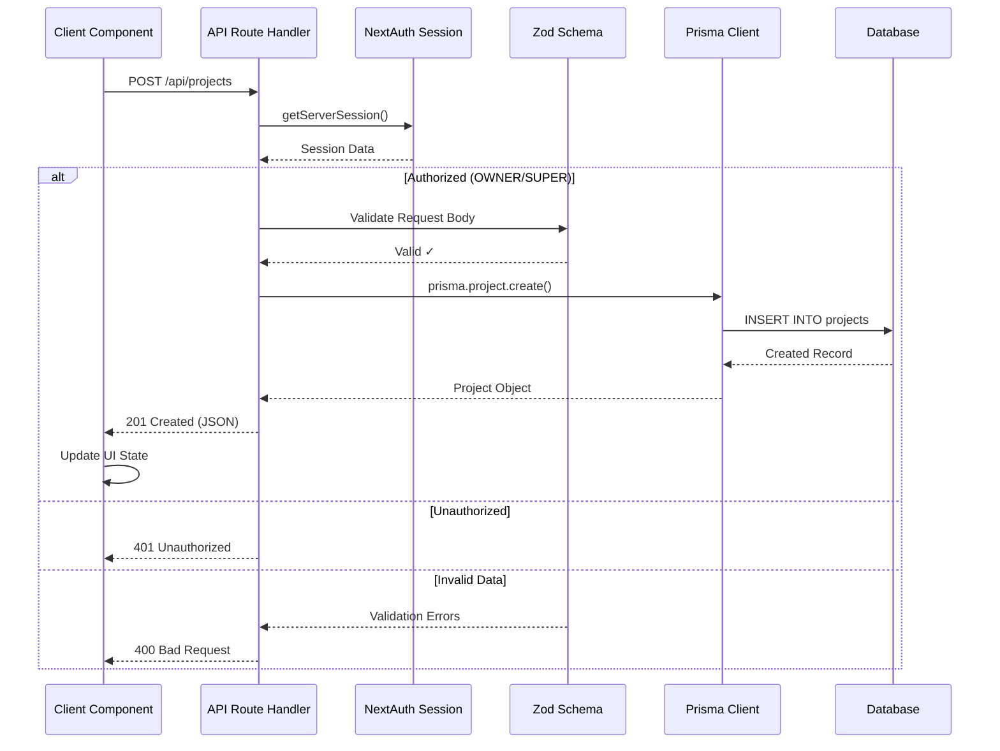

---

## Component Architecture

### Component Hierarchy

```mermaid
graph TD
    subgraph "Root Layout"
        RootLayout[layout.tsx<br/>Global Layout]
    end

    subgraph "Public Pages"
        HomePage[page.tsx<br/>Landing Page]
        ParallaxHero[ParallaxHero<br/>Hero Section]
        ParallaxSection[ParallaxSection<br/>Content Sections]
    end

    subgraph "Authentication"
        LoginPage[auth/login/page.tsx]
        LoginForm[LoginForm<br/>Client Component]
    end

    subgraph "Dashboard Pages"
        DashboardLayout[dashboard/layout.tsx<br/>Protected Layout]
        DashboardHome[dashboard/page.tsx]
        ProjectsPage[dashboard/projects/page.tsx]
        BoreLogsPage[dashboard/bore-logs/page.tsx]
        FieldReportsPage[dashboard/field-reports/page.tsx]
    end

    subgraph "Shared Components"
        DarkModeToggle[DarkModeToggle<br/>Theme Switcher]
        UserMenu[UserMenu<br/>User Dropdown]
        MobileMenu[MobileMenu<br/>Mobile Nav]
        OfflineSync[OfflineSyncIndicator<br/>Sync Status]
    end

    subgraph "Dashboard Components"
        KPIDashboard[KPIDashboard<br/>Analytics]
        AdvancedKPICards[AdvancedKPICards<br/>KPI Cards]
        PhotoGallery[PhotoGallery<br/>Image Gallery]
        PhotoUploader[PhotoUploader<br/>File Upload]
    end

    RootLayout --> HomePage
    RootLayout --> LoginPage
    RootLayout --> DashboardLayout

    HomePage --> ParallaxHero
    HomePage --> ParallaxSection

    LoginPage --> LoginForm

    DashboardLayout --> DashboardHome
    DashboardLayout --> ProjectsPage
    DashboardLayout --> BoreLogsPage
    DashboardLayout --> FieldReportsPage

    DashboardLayout --> DarkModeToggle
    DashboardLayout --> UserMenu
    DashboardLayout --> MobileMenu
    DashboardLayout --> OfflineSync

    DashboardHome --> KPIDashboard
    KPIDashboard --> AdvancedKPICards
    FieldReportsPage --> PhotoGallery
    FieldReportsPage --> PhotoUploader

    style RootLayout fill:#FF5A1F
    style DashboardLayout fill:#23272A
    style KPIDashboard fill:#4F5B66
```

### Component Categories

#### Server Components (Default)
- All page.tsx files (SSR by default)
- Layout components
- Data fetching components
- SEO-optimized pages

#### Client Components ("use client")
- Interactive forms (LoginForm, PhotoUploader)
- State management components (DarkModeToggle, UserMenu)
- Real-time UI (OfflineSyncIndicator, MobileMenu)
- Chart components (AdvancedKPICards, KPIDashboard)

---

## API Layer

### API Endpoint Architecture

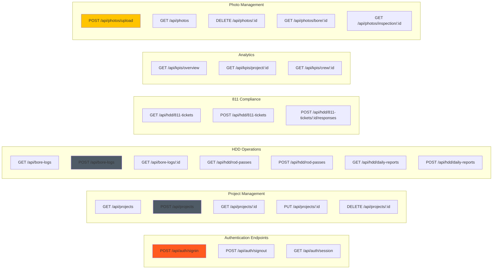

### API Route Structure

```
src/app/api/
├── auth/
│   └── [...nextauth]/route.ts          # NextAuth handlers
├── projects/
│   ├── route.ts                        # GET, POST /api/projects
│   └── [id]/route.ts                   # GET, PUT, DELETE /api/projects/:id
├── bore-logs/
│   ├── route.ts                        # GET, POST /api/bore-logs
│   └── [id]/route.ts                   # GET, PUT, DELETE /api/bore-logs/:id
├── hdd/
│   ├── 811-tickets/
│   │   ├── route.ts                    # GET, POST /api/hdd/811-tickets
│   │   └── [id]/
│   │       ├── route.ts                # GET, PUT, DELETE
│   │       └── responses/route.ts      # POST responses
│   ├── daily-reports/
│   │   ├── route.ts                    # GET, POST
│   │   └── [id]/route.ts               # GET, PUT, DELETE
│   ├── rod-passes/
│   │   ├── route.ts                    # GET, POST
│   │   └── [id]/route.ts               # GET, PUT, DELETE
│   ├── projects/route.ts               # GET HDD projects
│   └── kpis/route.ts                   # GET HDD KPIs
├── photos/
│   ├── upload/route.ts                 # POST upload
│   ├── [id]/route.ts                   # GET, DELETE photo
│   ├── bore/[id]/route.ts              # GET bore photos
│   └── inspection/[id]/route.ts        # GET inspection photos
├── kpis/
│   ├── overview/route.ts               # GET overall KPIs
│   ├── project/[id]/route.ts           # GET project KPIs
│   └── crew/[id]/route.ts              # GET crew KPIs
└── inspections/
    ├── route.ts                        # GET, POST
    └── [id]/route.ts                   # GET, PUT, DELETE
```

### API Standards

- **HTTP Methods:** RESTful conventions (GET, POST, PUT, DELETE)
- **Response Format:** JSON with consistent error structure
- **Authentication:** Bearer token via NextAuth session
- **Validation:** Zod schemas for request/response validation
- **Error Handling:** Standardized error responses with codes
- **Rate Limiting:** To be implemented in production

---

## Database Layer

### Prisma ORM Architecture

```mermaid
graph TB
    subgraph "Application Layer"
        APIRoute[API Route Handlers]
        ServerComponent[Server Components]
    end

    subgraph "Prisma Client Layer"
        PrismaClient[Prisma Client Instance]
        TypedModels[Type-Safe Models]
        QueryBuilder[Fluent Query API]
    end

    subgraph "Database Abstraction"
        PrismaEngine[Prisma Engine]
        Migrations[Prisma Migrate]
        Generator[Prisma Generator]
    end

    subgraph "Database Layer"
        DevDB[(SQLite<br/>Development)]
        ProdDB[(PostgreSQL<br/>Production)]
    end

    APIRoute --> PrismaClient
    ServerComponent --> PrismaClient

    PrismaClient --> TypedModels
    PrismaClient --> QueryBuilder

    TypedModels --> PrismaEngine
    QueryBuilder --> PrismaEngine

    PrismaEngine --> DevDB
    PrismaEngine --> ProdDB

    Migrations --> DevDB
    Migrations --> ProdDB
    Generator --> TypedModels

    style PrismaClient fill:#2D3748
    style DevDB fill:#4F5B66
    style ProdDB fill:#336791
```

### Database Models (16 Total)

#### Core Models
- **User** - User accounts with role-based access
- **Role** - Enum: OWNER, SUPER, CREW
- **ReportAudit** - Audit trail for report changes

#### HDD Operations Models
- **Project** - Construction projects
- **Bore** - HDD bore logs and alignments
- **RodPass** - Rod-by-rod drilling logs
- **DailyReport** - Daily field reports with crew, production, equipment

#### Quality & Compliance
- **Inspection** - QA/QC inspections
- **CorrectiveAction** - Inspection follow-ups
- **Ticket811** - 811 locate tickets
- **Ticket811Response** - Utility responses

#### Project Management
- **RFI** - Requests for Information
- **TMTicket** - Time & Materials tickets
- **ChangeOrder** - Contract change orders

#### Assets & Resources
- **Photo** - Photo management with metadata
- **Pit** - Entry/exit pit tracking
- **Event** - Field events and incidents

See [DATABASE-SCHEMA.md](./DATABASE-SCHEMA.md) for complete schema documentation.

---

## Authentication & Authorization

### NextAuth v5 (Auth.js) Flow

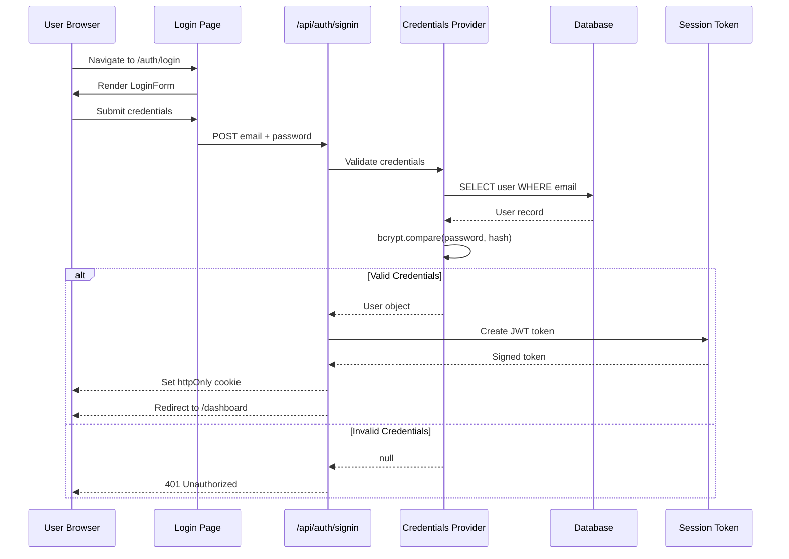

### Role-Based Access Control

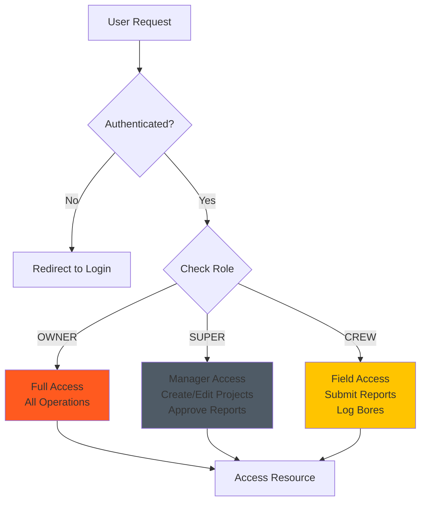

### Permission Matrix

| Role | Create Projects | Edit Projects | Submit Reports | Approve Reports | Manage Users | View Analytics |
|------|----------------|---------------|----------------|-----------------|--------------|----------------|
| **OWNER** | ✓ | ✓ | ✓ | ✓ | ✓ | ✓ |
| **SUPER** | ✓ | ✓ | ✓ | ✓ | ✗ | ✓ |
| **CREW** | ✗ | ✗ | ✓ | ✗ | ✗ | Limited |

---

## State Management

### State Management Strategy

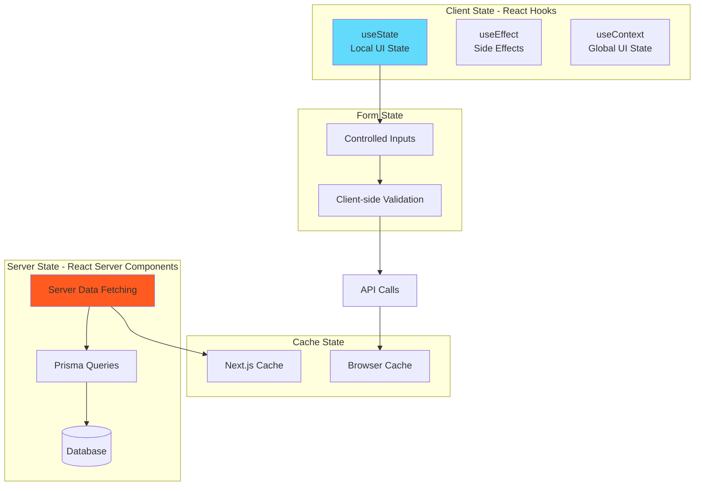

### State Patterns

1. **Server State (Preferred)**
   - React Server Components fetch data directly
   - No client-side state management needed
   - Automatic caching via Next.js

2. **Client State (When Needed)**
   - `useState` for local component state
   - `useContext` for shared UI state (theme, mobile menu)
   - Form state with controlled inputs

3. **No Global State Library**
   - No Redux, Zustand, or similar
   - Server components eliminate most client state needs
   - Context API sufficient for UI preferences

---

## Styling & Theming

### Tailwind CSS Architecture

```
├── tailwind.config.js          # Tailwind configuration
├── globals.css                 # Global styles + CSS variables
└── Component Styles            # Utility classes in JSX
```

### Brand Color System

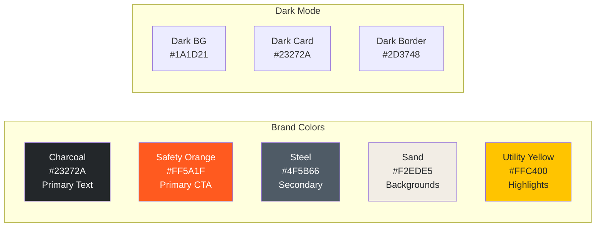

### Dark Mode Implementation

- CSS variables in `globals.css` for theme colors
- `<DarkModeToggle />` component manages theme state
- `localStorage` persistence for user preference
- Tailwind `dark:` variants for dark mode styles

---

## File Structure

```
midwest-underground-website/
├── public/                          # Static assets
│   ├── dashboard/                   # Static HTML dashboard (production)
│   │   ├── takeoff.html            # Takeoff & Estimating System
│   │   ├── index.html              # Dashboard home
│   │   ├── projects.html           # Project management
│   │   ├── bore-logs.html          # Bore log tracking
│   │   ├── field-reports.html      # Field reporting
│   │   ├── equipment.html          # Equipment tracking
│   │   ├── financials.html         # Financial analytics
│   │   ├── customers.html          # Customer management
│   │   ├── reports.html            # Report builder
│   │   ├── css/                    # Dashboard styles
│   │   └── js/                     # Dashboard scripts
│   ├── images/                     # Public images
│   └── fonts/                      # Custom fonts
│
├── src/                            # Next.js application
│   ├── app/                        # App Router
│   │   ├── layout.tsx              # Root layout
│   │   ├── page.tsx                # Homepage
│   │   ├── globals.css             # Global styles
│   │   ├── auth/                   # Authentication pages
│   │   │   └── login/page.tsx
│   │   ├── dashboard/              # Dashboard pages
│   │   │   ├── layout.tsx          # Dashboard layout
│   │   │   ├── page.tsx            # Dashboard home
│   │   │   ├── projects/page.tsx
│   │   │   ├── bore-logs/page.tsx
│   │   │   ├── field-reports/page.tsx
│   │   │   └── ...
│   │   └── api/                    # API routes
│   │       ├── auth/[...nextauth]/route.ts
│   │       ├── projects/route.ts
│   │       ├── bore-logs/route.ts
│   │       ├── hdd/
│   │       ├── photos/
│   │       └── kpis/
│   │
│   ├── components/                 # React components
│   │   ├── DarkModeToggle.tsx
│   │   ├── LoginForm.tsx
│   │   ├── UserMenu.tsx
│   │   ├── MobileMenu.tsx
│   │   ├── KPIDashboard.tsx
│   │   ├── AdvancedKPICards.tsx
│   │   ├── PhotoGallery.tsx
│   │   ├── PhotoUploader.tsx
│   │   ├── OfflineSyncIndicator.tsx
│   │   ├── ParallaxHero.tsx
│   │   └── ParallaxSection.tsx
│   │
│   └── lib/                        # Utilities & services
│       ├── prisma.ts               # Prisma client instance
│       ├── auth.ts                 # NextAuth configuration
│       ├── validations.ts          # Zod schemas
│       ├── kpiService.ts           # KPI calculations
│       ├── offlineSync.ts          # Offline sync logic
│       └── photo-storage.ts        # Photo upload/storage
│
├── prisma/                         # Database
│   ├── schema.prisma               # Database schema (16 models)
│   ├── migrations/                 # Migration history
│   └── seed.ts                     # Seed data
│
├── tests/                          # Test suites
│   ├── unit/                       # Unit tests (Vitest)
│   ├── integration/                # Integration tests
│   └── takeoff/                    # E2E tests (Playwright)
│
├── docs/                           # Documentation
│   ├── architecture/               # Architecture docs
│   ├── guides/                     # How-to guides
│   ├── brand/                      # Brand standards
│   └── features/                   # Feature docs
│
├── scripts/                        # Build scripts
│   └── docs/                       # Documentation scripts
│
├── .serena/                        # Serena MCP context
│   └── memories/                   # Session memories
│
├── next.config.js                  # Next.js configuration
├── tailwind.config.js              # Tailwind configuration
├── tsconfig.json                   # TypeScript configuration
├── playwright.config.ts            # Playwright configuration
├── vitest.config.ts                # Vitest configuration
└── package.json                    # Dependencies & scripts
```

---

## Deployment Architecture

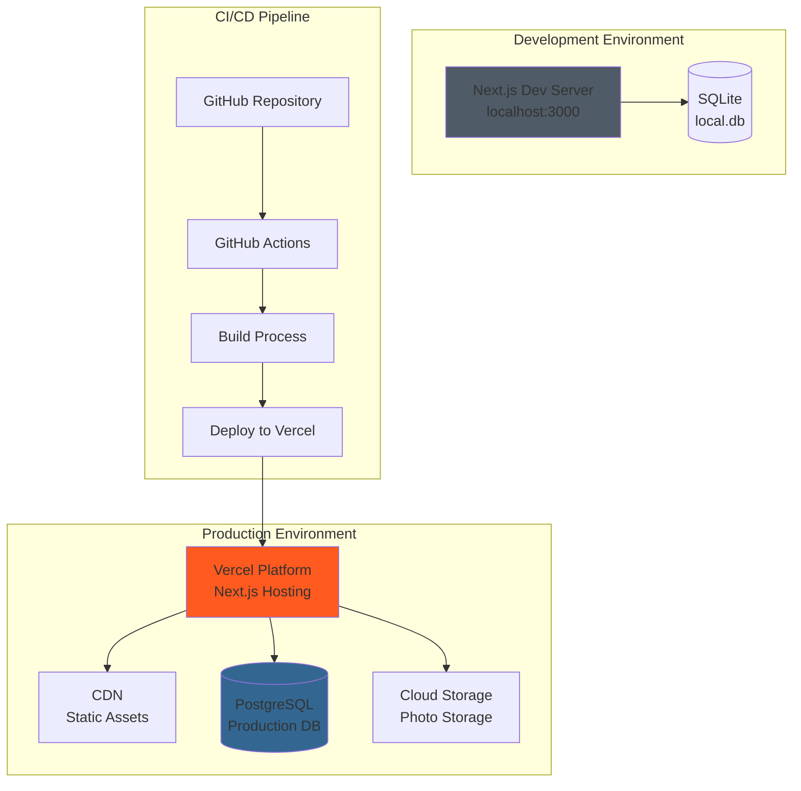

### Deployment Options

1. **Vercel (Recommended)**
   - Zero-config Next.js deployment
   - Automatic HTTPS and CDN
   - Serverless API routes
   - PostgreSQL via Vercel Postgres

2. **Netlify**
   - Alternative Next.js host
   - Edge functions for API routes
   - PostgreSQL via external provider

3. **Custom VPS**
   - Self-hosted Node.js server
   - PM2 process manager
   - Nginx reverse proxy
   - PostgreSQL database

---

## Related Documentation

- [Database Schema](./DATABASE-SCHEMA.md) - Complete database documentation
- [API Reference](./API-REFERENCE.md) - API endpoint specifications
- [Architectural Decisions](./DECISIONS.md) - ADRs and design rationale
- [Development Guide](../guides/DEVELOPMENT.md) - Local development setup
- [Testing Guide](../guides/TESTING.md) - Testing strategy
- [Deployment Guide](../guides/DEPLOYMENT.md) - Deployment procedures

---

## References

Based on 2025 best practices:
- [Mermaid Architecture Diagrams](https://mermaid.js.org/syntax/architecture.html)
- [Next.js 15 Documentation](https://nextjs.org/docs)
- [Prisma Best Practices](https://www.prisma.io/docs)
- [System Architecture Documentation Best Practices](https://www.freecodecamp.org/news/system-architecture-documentation-best-practices-and-tools/)

---

**Document Version:** 1.0.0
**Last Updated:** 2025-11-23
**Maintained By:** @nice-and-precise
