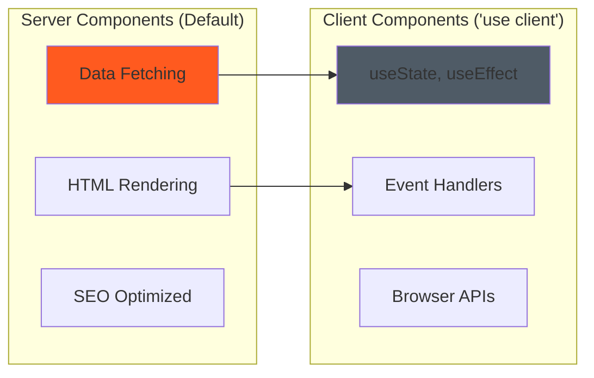
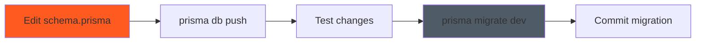

# Development Guide

**Last Updated:** 2025-11-23
**Version:** 1.0.0
**Target Audience:** Software Developers

---

## Table of Contents

- [Getting Started](#getting-started)
- [Development Environment](#development-environment)
- [Project Structure](#project-structure)
- [Development Workflow](#development-workflow)
- [Code Organization](#code-organization)
- [Component Development](#component-development)
- [API Route Development](#api-route-development)
- [Database Development](#database-development)
- [TypeScript Guidelines](#typescript-guidelines)
- [Testing During Development](#testing-during-development)
- [Debugging](#debugging)
- [Common Development Tasks](#common-development-tasks)
- [Troubleshooting](#troubleshooting)

---

## Getting Started

### Prerequisites

- **Node.js:** 18.x or higher (LTS recommended)
- **npm:** 9.x or higher (comes with Node.js)
- **Git:** Latest version
- **Code Editor:** VS Code recommended

### Quick Start

```bash
# Clone repository
git clone https://github.com/nice-and-precise/midwest-underground-website.git
cd midwest-underground-website

# Install dependencies
npm install

# Setup database
npm run db:push
npm run db:seed

# Start development server
npm run dev

# Open http://localhost:3000 in browser
```

### Development Server Access

- **Next.js App:** http://localhost:3000
- **Static Dashboard:** http://localhost:8000/public/dashboard/ (requires `python -m http.server 8000`)
- **Prisma Studio:** http://localhost:5555 (run `npm run db:studio`)

---

## Development Environment

### Recommended VS Code Extensions

```json
{
  "recommendations": [
    "dbaeumer.vscode-eslint",
    "esbenp.prettier-vscode",
    "bradlc.vscode-tailwindcss",
    "prisma.prisma",
    "ms-playwright.playwright",
    "yoavbls.pretty-ts-errors"
  ]
}
```

### Environment Variables

Create `.env` file in project root:

```env
# Database
DATABASE_URL="file:./dev.db"

# NextAuth
NEXTAUTH_URL="http://localhost:3000"
NEXTAUTH_SECRET="your-secret-key-here"

# Development
NODE_ENV="development"
```

### Git Configuration

```bash
# Set your Git identity
git config user.name "Your Name"
git config user.email "your.email@example.com"

# Set up branch auto-setup
git config --global push.autoSetupRemote true
```

---

## Project Structure

### Development Workflow Diagram

```mermaid
graph TB
    Dev[Developer] --> Branch[Create Feature Branch]
    Branch --> Code[Write Code]
    Code --> Test[Run Tests]
    Test --> Lint[Lint & Format]
    Lint --> Commit[Commit Changes]
    Commit --> Push[Push to GitHub]
    Push --> PR[Create Pull Request]
    PR --> Review[Code Review]
    Review --> Merge[Merge to Main]

    style Dev fill:#FF5A1F
    style Test fill:#4F5B66
    style Merge fill:#23272A
```



### Directory Structure

```
midwest-underground-website/
├── src/                          # Next.js application source
│   ├── app/                      # App Router (pages and API routes)
│   │   ├── layout.tsx            # Root layout
│   │   ├── page.tsx              # Homepage
│   │   ├── globals.css           # Global styles
│   │   ├── auth/                 # Authentication pages
│   │   ├── dashboard/            # Protected dashboard pages
│   │   └── api/                  # API routes
│   ├── components/               # React components
│   └── lib/                      # Utilities and services
│
├── prisma/                       # Database configuration
│   ├── schema.prisma             # Database schema
│   ├── migrations/               # Migration history
│   └── seed.ts                   # Seed data
│
├── public/                       # Static assets
│   ├── dashboard/                # Legacy static dashboard
│   ├── images/                   # Images
│   └── fonts/                    # Fonts
│
├── tests/                        # Test suites
│   ├── unit/                     # Unit tests
│   ├── integration/              # Integration tests
│   └── e2e/                      # E2E tests (Playwright)
│
├── docs/                         # Documentation
├── scripts/                      # Build and utility scripts
├── .serena/                      # Serena MCP context
└── .claude/                      # Claude Code configurations
```

---

## Development Workflow

### Branch Naming Convention

```bash
feat/feature-name      # New feature
fix/bug-name          # Bug fix
docs/topic-name       # Documentation
refactor/scope-name   # Code refactoring
test/test-name        # Test additions
```

### Typical Development Flow

```bash
# 1. Create feature branch
git checkout -b feat/add-bore-export

# 2. Make changes
# ... edit files ...

# 3. Run tests
npm test
npm run lint

# 4. Commit changes (Conventional Commits)
git add .
git commit -m "feat(bore): add CSV export functionality"

# 5. Push to GitHub
git push origin feat/add-bore-export

# 6. Create Pull Request on GitHub
```

### Commit Message Format (Conventional Commits)

```
<type>(<scope>): <description>

[optional body]

[optional footer]
```

**Types:**
- `feat:` New feature
- `fix:` Bug fix
- `docs:` Documentation
- `style:` Formatting, missing semi-colons, etc.
- `refactor:` Code restructuring
- `test:` Adding tests
- `chore:` Maintenance tasks

**Example:**
```bash
feat(bore-logs): add CSV export functionality

- Implement CSV generation from bore data
- Add download button to bore list page
- Include all rod pass data in export

Closes #123
```

---

## Code Organization

### Component Organization

```typescript
// src/components/BoreLogCard.tsx
'use client'; // Only if client-side interactivity needed

import { Bore } from '@prisma/client';

interface BoreLogCardProps {
  bore: Bore;
  onEdit?: (id: string) => void;
}

export function BoreLogCard({ bore, onEdit }: BoreLogCardProps) {
  return (
    <div className="border rounded-lg p-4">
      <h3>{bore.name}</h3>
      <p>Status: {bore.status}</p>
      {onEdit && (
        <button onClick={() => onEdit(bore.id)}>
          Edit
        </button>
      )}
    </div>
  );
}
```

### API Route Organization

```typescript
// src/app/api/projects/route.ts
import { NextRequest } from 'next/server';
import { prisma } from '@/lib/prisma';
import { projectSchema } from '@/lib/validations';

export async function GET(request: NextRequest) {
  // 1. Parse query params
  const { searchParams } = new URL(request.url);
  const status = searchParams.get('status');

  // 2. Query database
  const projects = await prisma.project.findMany({
    where: status ? { status: status as any } : {},
    include: { createdBy: true }
  });

  // 3. Return JSON
  return Response.json({ projects });
}

export async function POST(request: NextRequest) {
  try {
    // 1. Parse request body
    const body = await request.json();

    // 2. Validate with Zod
    const validatedData = projectSchema.parse(body);

    // 3. Create in database
    const project = await prisma.project.create({
      data: validatedData
    });

    // 4. Return 201 Created
    return Response.json({ project }, { status: 201 });
  } catch (error) {
    // 5. Handle errors
    return Response.json(
      { error: 'Failed to create project' },
      { status: 500 }
    );
  }
}
```

---

## Component Development

### Server vs. Client Components



**Server Components (Default):**
- Data fetching from database
- Static content rendering
- SEO-critical pages

**Client Components (`"use client"`):**
- Interactive forms
- Event handlers (onClick, onChange)
- Browser APIs (localStorage, window)
- State management (useState, useContext)

### Creating a New Component

```bash
# Create component file
touch src/components/MyComponent.tsx

# Add to exports (if using barrel exports)
# echo "export * from './MyComponent'" >> src/components/index.ts
```

**Template:**
```typescript
// src/components/MyComponent.tsx
'use client'; // Only if needed

import { FC } from 'react';

interface MyComponentProps {
  title: string;
  count?: number;
}

export const MyComponent: FC<MyComponentProps> = ({
  title,
  count = 0
}) => {
  return (
    <div className="p-4 border rounded">
      <h2 className="text-xl font-bold">{title}</h2>
      <p>Count: {count}</p>
    </div>
  );
};
```

---

## API Route Development

### Creating a New API Route

```bash
# Create resource directory
mkdir -p src/app/api/my-resource

# Create route handler
touch src/app/api/my-resource/route.ts

# Create dynamic route (optional)
mkdir -p src/app/api/my-resource/[id]
touch src/app/api/my-resource/[id]/route.ts
```

### API Route Template

```typescript
// src/app/api/my-resource/route.ts
import { NextRequest } from 'next/server';
import { prisma } from '@/lib/prisma';
import { myResourceSchema } from '@/lib/validations';
import { getServerSession } from 'next-auth';

// GET /api/my-resource
export async function GET(request: NextRequest) {
  try {
    // Check authentication
    const session = await getServerSession();
    if (!session) {
      return Response.json({ error: 'Unauthorized' }, { status: 401 });
    }

    // Parse query params
    const { searchParams } = new URL(request.url);
    const limit = parseInt(searchParams.get('limit') || '50');

    // Query database
    const resources = await prisma.myResource.findMany({
      take: limit,
      orderBy: { createdAt: 'desc' }
    });

    return Response.json({ resources });
  } catch (error) {
    console.error('Error fetching resources:', error);
    return Response.json(
      { error: 'Internal server error' },
      { status: 500 }
    );
  }
}

// POST /api/my-resource
export async function POST(request: NextRequest) {
  try {
    // Check authentication
    const session = await getServerSession();
    if (!session) {
      return Response.json({ error: 'Unauthorized' }, { status: 401 });
    }

    // Parse and validate body
    const body = await request.json();
    const validatedData = myResourceSchema.parse(body);

    // Create resource
    const resource = await prisma.myResource.create({
      data: validatedData
    });

    return Response.json({ resource }, { status: 201 });
  } catch (error) {
    if (error instanceof z.ZodError) {
      return Response.json(
        { error: 'Validation failed', details: error.errors },
        { status: 400 }
      );
    }

    console.error('Error creating resource:', error);
    return Response.json(
      { error: 'Internal server error' },
      { status: 500 }
    );
  }
}
```

---

## Database Development

### Database Workflow



### Editing the Schema

1. **Edit `prisma/schema.prisma`:**
```prisma
model MyNewModel {
  id        String   @id @default(cuid())
  name      String
  createdAt DateTime @default(now())

  // Relations
  userId    String
  user      User     @relation(fields: [userId], references: [id])

  @@index([userId])
}
```

2. **Push changes to database (dev):**
```bash
npx prisma db push
```

3. **Regenerate Prisma Client:**
```bash
npx prisma generate
```

4. **Create migration (when ready):**
```bash
npx prisma migrate dev --name add-my-new-model
```

### Common Prisma Commands

```bash
# Push schema changes (dev only, no migration)
npx prisma db push

# Create migration
npx prisma migrate dev --name migration-name

# Apply migrations (production)
npx prisma migrate deploy

# Reset database (WARNING: deletes all data)
npx prisma migrate reset

# Open Prisma Studio (database GUI)
npx prisma studio

# Seed database
npx prisma db seed

# Generate Prisma Client
npx prisma generate
```

### Querying with Prisma

```typescript
// Find one
const project = await prisma.project.findUnique({
  where: { id: projectId },
  include: { bores: true }
});

// Find many with filtering
const projects = await prisma.project.findMany({
  where: {
    status: 'IN_PROGRESS',
    createdBy: { role: 'OWNER' }
  },
  orderBy: { createdAt: 'desc' },
  take: 10
});

// Create
const project = await prisma.project.create({
  data: {
    name: 'New Project',
    status: 'PLANNING',
    createdById: userId
  }
});

// Update
const project = await prisma.project.update({
  where: { id: projectId },
  data: { status: 'COMPLETED' }
});

// Delete
await prisma.project.delete({
  where: { id: projectId }
});
```

---

## TypeScript Guidelines

### Type Definitions

```typescript
// Use Prisma-generated types
import { Project, Bore, User } from '@prisma/client';

// Create custom types from Prisma types
type ProjectWithBores = Project & {
  bores: Bore[];
};

// Extract partial types
type ProjectInput = Omit<Project, 'id' | 'createdAt' | 'updatedAt'>;

// Define prop types
interface ProjectCardProps {
  project: Project;
  onEdit?: (id: string) => void;
  className?: string;
}
```

### Type Safety Best Practices

1. **Never use `any`** - Use `unknown` if type is truly unknown
2. **Prefer interfaces over types** for object shapes
3. **Use Zod schemas** for runtime validation
4. **Export types** from component files for reuse

---

## Testing During Development

### Run Tests Before Committing

```bash
# Run all tests
npm test

# Run tests in watch mode
npm test -- --watch

# Run specific test file
npm test tests/unit/api/projects.test.ts

# Run E2E tests
npm run test:e2e

# Run tests with coverage
npm run test:coverage
```

### Writing Unit Tests

```typescript
// tests/unit/lib/kpiService.test.ts
import { describe, it, expect } from 'vitest';
import { calculateLinearFeet } from '@/lib/kpiService';

describe('KPI Service', () => {
  describe('calculateLinearFeet', () => {
    it('should sum linear feet from rod passes', () => {
      const rodPasses = [
        { linearFeet: 50.0 },
        { linearFeet: 75.5 },
        { linearFeet: 100.0 }
      ];

      const result = calculateLinearFeet(rodPasses);

      expect(result).toBe(225.5);
    });

    it('should return 0 for empty array', () => {
      expect(calculateLinearFeet([])).toBe(0);
    });
  });
});
```

---

## Debugging

### VS Code Debugger Configuration

Create `.vscode/launch.json`:

```json
{
  "version": "0.2.0",
  "configurations": [
    {
      "name": "Next.js: debug server-side",
      "type": "node-terminal",
      "request": "launch",
      "command": "npm run dev"
    },
    {
      "name": "Next.js: debug client-side",
      "type": "chrome",
      "request": "launch",
      "url": "http://localhost:3000"
    }
  ]
}
```

### Browser DevTools

- **React DevTools:** Install browser extension
- **Network Tab:** Inspect API requests/responses
- **Console:** View client-side errors and logs

### Debugging Prisma Queries

```bash
# Enable query logging
DATABASE_URL="file:./dev.db"
DEBUG="prisma:query"

# Run dev server with query logging
DEBUG="prisma:query" npm run dev
```

---

## Common Development Tasks

### Add a New Page

```bash
# Create page file
touch src/app/dashboard/my-page/page.tsx
```

```typescript
// src/app/dashboard/my-page/page.tsx
import { prisma } from '@/lib/prisma';

export default async function MyPage() {
  // Server-side data fetching
  const data = await prisma.myModel.findMany();

  return (
    <div>
      <h1>My Page</h1>
      {/* Render data */}
    </div>
  );
}
```

### Add a New Database Model

1. Edit `prisma/schema.prisma`
2. Run `npx prisma db push`
3. Run `npx prisma migrate dev --name add-my-model`
4. Update seed data in `prisma/seed.ts`
5. Commit migration files

### Add Form Validation

```typescript
// src/lib/validations.ts
import { z } from 'zod';

export const myFormSchema = z.object({
  name: z.string().min(3, 'Name must be at least 3 characters'),
  email: z.string().email('Invalid email address'),
  age: z.number().min(18, 'Must be 18 or older')
});

export type MyFormInput = z.infer<typeof myFormSchema>;
```

---

## Troubleshooting

### Common Issues

**Issue:** `Module not found` error
**Solution:** Run `npm install`, check import paths

**Issue:** Prisma Client errors
**Solution:** Run `npx prisma generate`

**Issue:** Port 3000 already in use
**Solution:** Kill process or use different port: `PORT=3001 npm run dev`

**Issue:** Database schema out of sync
**Solution:** Run `npx prisma db push` or `npx prisma migrate dev`

**Issue:** TypeScript errors after dependency update
**Solution:** Delete `node_modules/`, `.next/`, run `npm install`

---

## Related Documentation

- [Architecture Overview](../architecture/OVERVIEW.md)
- [Database Schema](../architecture/DATABASE-SCHEMA.md)
- [API Reference](../architecture/API-REFERENCE.md)
- [Testing Guide](./TESTING.md)
- [Deployment Guide](./DEPLOYMENT.md)

---

## References

- [Next.js Documentation](https://nextjs.org/docs)
- [Prisma Documentation](https://www.prisma.io/docs)
- [TypeScript Handbook](https://www.typescriptlang.org/docs/)
- [React Documentation](https://react.dev)

---

**Document Version:** 1.0.0
**Last Updated:** 2025-11-23
**Maintained By:** @nice-and-precise
