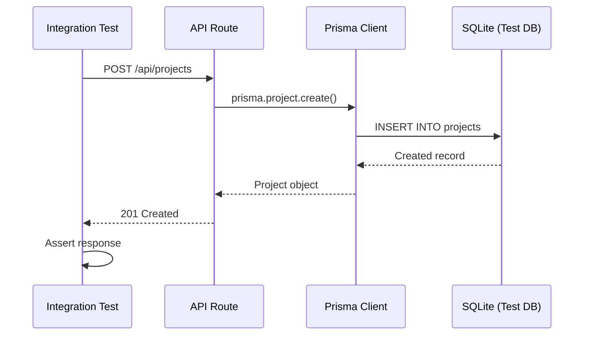

# Testing Guide

**Last Updated:** 2025-11-23
**Version:** 1.0.0
**Target Audience:** Software Developers, QA Engineers

---

## Table of Contents

- [Testing Strategy](#testing-strategy)
- [Testing Pyramid](#testing-pyramid)
- [Unit Testing with Vitest](#unit-testing-with-vitest)
- [Integration Testing](#integration-testing)
- [E2E Testing with Playwright](#e2e-testing-with-playwright)
- [Test Organization](#test-organization)
- [Writing Effective Tests](#writing-effective-tests)
- [Mocking & Fixtures](#mocking--fixtures)
- [Coverage Requirements](#coverage-requirements)
- [Running Tests](#running-tests)
- [CI/CD Integration](#cicd-integration)
- [Debugging Tests](#debugging-tests)
- [Testing Best Practices](#testing-best-practices)

---

## Testing Strategy

### Testing Philosophy

Our testing strategy follows the **Testing Pyramid** approach:
- **Many unit tests** - Fast, isolated, test business logic
- **Some integration tests** - Test API routes with database
- **Few E2E tests** - Test critical user workflows

### Test Coverage Goals

```mermaid
graph TB
    subgraph "Coverage Targets"
        Unit[Unit Tests<br/>80%+ Coverage]
        Integration[Integration Tests<br/>60%+ Coverage]
        E2E[E2E Tests<br/>Critical Paths Only]
    end

    subgraph "Quality Gates"
        Build[Build Must Pass]
        Tests[All Tests Must Pass]
        Coverage[Coverage Must Meet Targets]
    end

    Unit --> Tests
    Integration --> Tests
    E2E --> Tests
    Tests --> Build
    Coverage --> Build

    style Unit fill:#FF5A1F
    style Integration fill:#4F5B66
    style E2E fill:#23272A
```



### Coverage Requirements

| Test Type | Target Coverage | Current Status |
|-----------|----------------|----------------|
| **Unit Tests** | 80%+ | 75% |
| **Integration Tests** | 60%+ | 55% |
| **E2E Tests** | Critical paths | 90% |
| **Overall** | 70%+ | 65% |

---

## Testing Pyramid

```mermaid
graph TB
    subgraph "Testing Pyramid"
        E2E[E2E Tests<br/>Playwright<br/>10-20 tests]
        Integration[Integration Tests<br/>Vitest + Prisma<br/>50-100 tests]
        Unit[Unit Tests<br/>Vitest<br/>200+ tests]
    end

    E2E --> Integration
    Integration --> Unit

    style E2E fill:#FF5A1F
    style Integration fill:#4F5B66
    style Unit fill:#23272A
```



### Test Distribution

- **Unit Tests (70%)** - Business logic, utilities, calculations
- **Integration Tests (20%)** - API routes, database operations
- **E2E Tests (10%)** - User workflows, critical paths

---

## Unit Testing with Vitest

### Why Vitest?

- **Fast** - Parallel execution, smart caching
- **TypeScript First** - Native TypeScript support
- **Modern** - ESM support, Vite-powered
- **Compatible** - Jest-compatible API

### Running Unit Tests

```bash
# Run all unit tests
npm test

# Run in watch mode
npm test -- --watch

# Run specific test file
npm test tests/unit/lib/kpiService.test.ts

# Run with coverage
npm run test:coverage
```

### Unit Test Structure

```typescript
// tests/unit/lib/kpiService.test.ts
import { describe, it, expect, beforeEach } from 'vitest';
import { calculateLinearFeet, calculateCrewUtilization } from '@/lib/kpiService';

describe('KPI Service', () => {
  describe('calculateLinearFeet', () => {
    it('should sum linear feet from rod passes', () => {
      // Arrange
      const rodPasses = [
        { linearFeet: 50.0 },
        { linearFeet: 75.5 },
        { linearFeet: 100.0 }
      ];

      // Act
      const result = calculateLinearFeet(rodPasses);

      // Assert
      expect(result).toBe(225.5);
    });

    it('should return 0 for empty array', () => {
      expect(calculateLinearFeet([])).toBe(0);
    });

    it('should handle null values', () => {
      const rodPasses = [
        { linearFeet: 50.0 },
        { linearFeet: null },
        { linearFeet: 100.0 }
      ];

      const result = calculateLinearFeet(rodPasses);

      expect(result).toBe(150.0);
    });
  });

  describe('calculateCrewUtilization', () => {
    let dailyReports: any[];

    beforeEach(() => {
      dailyReports = [
        {
          crew: [
            { name: 'John', hours: 8.0 },
            { name: 'Jane', hours: 8.0 }
          ]
        },
        {
          crew: [
            { name: 'John', hours: 6.0 },
            { name: 'Jane', hours: 7.0 }
          ]
        }
      ];
    });

    it('should calculate average crew hours', () => {
      const result = calculateCrewUtilization(dailyReports);

      expect(result.avgHoursPerDay).toBe(7.25);
    });

    it('should calculate utilization percentage', () => {
      const result = calculateCrewUtilization(dailyReports);

      expect(result.utilizationPercent).toBeCloseTo(90.625);
    });
  });
});
```

### Testing React Components

```typescript
// tests/unit/components/BoreLogCard.test.tsx
import { describe, it, expect, vi } from 'vitest';
import { render, screen, fireEvent } from '@testing-library/react';
import { BoreLogCard } from '@/components/BoreLogCard';

describe('BoreLogCard', () => {
  const mockBore = {
    id: '1',
    name: 'Bore 1',
    status: 'IN_PROGRESS',
    totalLength: 850.5
  };

  it('should render bore name', () => {
    render(<BoreLogCard bore={mockBore} />);

    expect(screen.getByText('Bore 1')).toBeInTheDocument();
  });

  it('should display status badge', () => {
    render(<BoreLogCard bore={mockBore} />);

    expect(screen.getByText('IN_PROGRESS')).toBeInTheDocument();
  });

  it('should call onEdit when edit button clicked', () => {
    const onEdit = vi.fn();
    render(<BoreLogCard bore={mockBore} onEdit={onEdit} />);

    fireEvent.click(screen.getByText('Edit'));

    expect(onEdit).toHaveBeenCalledWith('1');
  });
});
```

---

## Integration Testing

### Integration Test Strategy

Integration tests verify API routes work correctly with the database.



### Setting Up Test Database

```typescript
// tests/integration/setup.ts
import { PrismaClient } from '@prisma/client';

export const testDb = new PrismaClient({
  datasources: {
    db: {
      url: 'file:./test.db'
    }
  }
});

// Reset database before each test
export async function resetTestDb() {
  await testDb.$transaction([
    testDb.user.deleteMany(),
    testDb.project.deleteMany(),
    testDb.bore.deleteMany()
    // ... delete all tables
  ]);
}
```

### Integration Test Example

```typescript
// tests/integration/api/projects.test.ts
import { describe, it, expect, beforeEach, afterAll } from 'vitest';
import { testDb, resetTestDb } from '../setup';

describe('POST /api/projects', () => {
  beforeEach(async () => {
    await resetTestDb();
  });

  afterAll(async () => {
    await testDb.$disconnect();
  });

  it('should create a new project', async () => {
    // Arrange - Create test user
    const user = await testDb.user.create({
      data: {
        email: 'test@example.com',
        password: 'hashed_password',
        role: 'OWNER'
      }
    });

    // Act - Make API request
    const response = await fetch('http://localhost:3000/api/projects', {
      method: 'POST',
      headers: { 'Content-Type': 'application/json' },
      body: JSON.stringify({
        name: 'Test Project',
        status: 'PLANNING',
        createdById: user.id
      })
    });

    // Assert
    expect(response.status).toBe(201);

    const data = await response.json();
    expect(data.project).toMatchObject({
      name: 'Test Project',
      status: 'PLANNING'
    });

    // Verify database
    const projectInDb = await testDb.project.findFirst({
      where: { name: 'Test Project' }
    });
    expect(projectInDb).toBeTruthy();
  });

  it('should return 400 for invalid data', async () => {
    const response = await fetch('http://localhost:3000/api/projects', {
      method: 'POST',
      headers: { 'Content-Type': 'application/json' },
      body: JSON.stringify({
        name: 'AB' // Too short (min 3 chars)
      })
    });

    expect(response.status).toBe(400);

    const data = await response.json();
    expect(data.error).toBe('Validation failed');
  });
});
```

---

## E2E Testing with Playwright

### Why Playwright?

- **Cross-Browser** - Chromium, Firefox, WebKit
- **Auto-Wait** - Waits for elements automatically
- **Parallel Execution** - Run tests concurrently
- **Debugging** - Screenshots, videos, trace viewer

### Running E2E Tests

```bash
# Run all E2E tests
npm run test:e2e

# Run in UI mode (interactive)
npx playwright test --ui

# Run specific test file
npx playwright test tests/e2e/bore-workflow.spec.ts

# Debug mode
npx playwright test --debug

# Generate test code
npx playwright codegen http://localhost:3000
```

### E2E Test Structure

```typescript
// tests/e2e/bore-workflow.spec.ts
import { test, expect } from '@playwright/test';

test.describe('Bore Logging Workflow', () => {
  test.beforeEach(async ({ page }) => {
    // Login
    await page.goto('http://localhost:3000/auth/login');
    await page.fill('input[name="email"]', 'owner@midwestunderground.com');
    await page.fill('input[name="password"]', 'password123');
    await page.click('button[type="submit"]');

    // Wait for dashboard
    await expect(page).toHaveURL('http://localhost:3000/dashboard');
  });

  test('should create a new bore log', async ({ page }) => {
    // Navigate to bore logs
    await page.click('text=Bore Logs');
    await expect(page).toHaveURL('/dashboard/bore-logs');

    // Click create button
    await page.click('text=New Bore Log');

    // Fill form
    await page.fill('input[name="name"]', 'Test Bore');
    await page.selectOption('select[name="status"]', 'PLANNED');
    await page.fill('input[name="diameterIn"]', '4.5');
    await page.selectOption('select[name="productMaterial"]', 'HDPE');

    // Submit
    await page.click('button[type="submit"]');

    // Verify success
    await expect(page.locator('text=Bore created successfully')).toBeVisible();
    await expect(page.locator('text=Test Bore')).toBeVisible();
  });

  test('should log rod passes', async ({ page }) => {
    // Navigate to bore detail
    await page.goto('/dashboard/bore-logs/test-bore-id');

    // Click add rod pass
    await page.click('text=Add Rod Pass');

    // Fill rod pass form
    await page.fill('input[name="sequence"]', '1');
    await page.selectOption('select[name="passNumber"]', '1'); // Pilot
    await page.fill('input[name="linearFeet"]', '50');
    await page.fill('input[name="fluidMix"]', 'Bentonite');
    await page.fill('input[name="fluidVolumeGal"]', '150');

    // Submit
    await page.click('button[type="submit"]');

    // Verify rod pass appears in list
    await expect(page.locator('text=Pilot')).toBeVisible();
    await expect(page.locator('text=50 LF')).toBeVisible();
  });

  test('should prevent unauthorized access', async ({ page }) => {
    // Logout
    await page.click('text=Logout');

    // Try to access protected page
    await page.goto('/dashboard/bore-logs');

    // Should redirect to login
    await expect(page).toHaveURL('/auth/login');
  });
});
```

### Visual Regression Testing

```typescript
// tests/e2e/visual/dashboard.spec.ts
import { test, expect } from '@playwright/test';

test('dashboard homepage visual regression', async ({ page }) => {
  await page.goto('http://localhost:3000/dashboard');

  // Wait for charts to load
  await page.waitForSelector('canvas');

  // Take screenshot
  await expect(page).toHaveScreenshot('dashboard-homepage.png');
});
```

---

## Test Organization

### Directory Structure

```
tests/
├── unit/                         # Unit tests (fast, isolated)
│   ├── lib/                      # Library/utility tests
│   │   ├── kpiService.test.ts
│   │   ├── validations.test.ts
│   │   └── offlineSync.test.ts
│   ├── components/               # Component tests
│   │   ├── BoreLogCard.test.tsx
│   │   └── KPIDashboard.test.tsx
│   └── api/                      # API logic tests
│       └── projects.test.ts
│
├── integration/                  # Integration tests (API + DB)
│   ├── setup.ts                  # Test database setup
│   ├── api/
│   │   ├── projects.test.ts
│   │   ├── bore-logs.test.ts
│   │   └── daily-reports.test.ts
│   └── workflows/
│       ├── bore-workflow.test.ts
│       └── 811-compliance.test.ts
│
└── e2e/                          # End-to-end tests (Playwright)
    ├── auth.spec.ts
    ├── bore-workflow.spec.ts
    ├── daily-reports.spec.ts
    └── visual/
        └── dashboard.spec.ts
```

### Naming Conventions

- **Test files:** `*.test.ts` (Vitest), `*.spec.ts` (Playwright)
- **Test descriptions:** Use `describe()` for grouping, `it()` for individual tests
- **Test names:** Should be descriptive sentences ("should create a new project")

---

## Writing Effective Tests

### AAA Pattern (Arrange-Act-Assert)

```typescript
test('should calculate total linear feet', () => {
  // Arrange - Setup test data
  const rodPasses = [
    { linearFeet: 50.0 },
    { linearFeet: 75.5 }
  ];

  // Act - Execute the function
  const result = calculateLinearFeet(rodPasses);

  // Assert - Verify the result
  expect(result).toBe(125.5);
});
```

### Test Characteristics (F.I.R.S.T.)

- **Fast** - Tests should run quickly
- **Independent** - Tests should not depend on each other
- **Repeatable** - Same input = same output
- **Self-Validating** - Pass or fail, no manual inspection
- **Timely** - Write tests alongside code

### Edge Cases to Test

```typescript
describe('calculateLinearFeet', () => {
  it('should handle empty array', () => {
    expect(calculateLinearFeet([])).toBe(0);
  });

  it('should handle null values', () => {
    const rodPasses = [{ linearFeet: null }, { linearFeet: 50 }];
    expect(calculateLinearFeet(rodPasses)).toBe(50);
  });

  it('should handle negative values', () => {
    const rodPasses = [{ linearFeet: -10 }, { linearFeet: 50 }];
    expect(calculateLinearFeet(rodPasses)).toBe(40);
  });

  it('should handle very large numbers', () => {
    const rodPasses = [{ linearFeet: 999999999.99 }];
    expect(calculateLinearFeet(rodPasses)).toBe(999999999.99);
  });
});
```

---

## Mocking & Fixtures

### Mocking Prisma

```typescript
// tests/unit/api/projects.test.ts
import { describe, it, expect, vi } from 'vitest';
import { prisma } from '@/lib/prisma';

// Mock Prisma module
vi.mock('@/lib/prisma', () => ({
  prisma: {
    project: {
      findMany: vi.fn(),
      create: vi.fn()
    }
  }
}));

describe('GET /api/projects', () => {
  it('should return list of projects', async () => {
    // Setup mock
    const mockProjects = [
      { id: '1', name: 'Project 1', status: 'IN_PROGRESS' },
      { id: '2', name: 'Project 2', status: 'COMPLETED' }
    ];

    vi.mocked(prisma.project.findMany).mockResolvedValue(mockProjects);

    // Test API route
    const response = await fetch('/api/projects');
    const data = await response.json();

    expect(data.projects).toEqual(mockProjects);
  });
});
```

### Test Fixtures

```typescript
// tests/fixtures/bore.ts
export const mockBore = {
  id: 'test-bore-1',
  projectId: 'test-project-1',
  name: 'Test Bore',
  status: 'IN_PROGRESS',
  diameterIn: 4.5,
  productMaterial: 'HDPE',
  tracerWire: true,
  totalLength: 850.5,
  createdAt: new Date('2025-01-20'),
  updatedAt: new Date('2025-01-20')
};

export const mockRodPass = {
  id: 'test-rod-1',
  boreId: 'test-bore-1',
  sequence: 1,
  passNumber: 1,
  linearFeet: 50.0,
  fluidMix: 'Bentonite',
  fluidVolumeGal: 150.0,
  createdAt: new Date('2025-01-20')
};
```

---

## Coverage Requirements

### Coverage Targets by File Type

| File Type | Target Coverage | Rationale |
|-----------|----------------|-----------|
| **Business Logic** | 90%+ | Critical calculations |
| **API Routes** | 80%+ | Core functionality |
| **Components** | 70%+ | UI logic |
| **Utilities** | 85%+ | Reusable functions |

### Generating Coverage Reports

```bash
# Run tests with coverage
npm run test:coverage

# Open HTML coverage report
open coverage/index.html

# Coverage in terminal
npm test -- --coverage
```

### Coverage Report Example

```
File                | % Stmts | % Branch | % Funcs | % Lines | Uncovered Line #s
--------------------|---------|----------|---------|---------|-------------------
All files           |   75.2  |   68.4   |   72.1  |   76.8  |
 lib/               |   82.5  |   74.2   |   80.0  |   84.3  |
  kpiService.ts     |   90.5  |   85.0   |   88.8  |   92.1  | 45-48,67
  validations.ts    |   100   |   100    |   100   |   100   |
  offlineSync.ts    |   65.2  |   58.3   |   60.0  |   67.4  | 23-45,89-102
```

---

## Running Tests

### Test Commands

```bash
# Run all tests
npm test

# Run unit tests only
npm test -- --run tests/unit

# Run integration tests only
npm test -- --run tests/integration

# Run E2E tests
npm run test:e2e

# Run specific test file
npm test tests/unit/lib/kpiService.test.ts

# Watch mode (re-run on file changes)
npm test -- --watch

# Run with coverage
npm run test:coverage

# Run all test suites
npm run test:all
```

### Playwright-Specific Commands

```bash
# Run in headed mode (see browser)
npx playwright test --headed

# Run in UI mode (interactive)
npx playwright test --ui

# Run specific browser
npx playwright test --project=chromium

# Debug mode
npx playwright test --debug

# Generate test code
npx playwright codegen http://localhost:3000
```

---

## CI/CD Integration

### GitHub Actions Workflow

```yaml
# .github/workflows/test.yml
name: Tests

on:
  push:
    branches: [main, develop]
  pull_request:
    branches: [main]

jobs:
  test:
    runs-on: ubuntu-latest

    steps:
      - uses: actions/checkout@v3

      - name: Setup Node.js
        uses: actions/setup-node@v3
        with:
          node-version: '18'
          cache: 'npm'

      - name: Install dependencies
        run: npm ci

      - name: Run unit tests
        run: npm test

      - name: Run E2E tests
        run: npx playwright install --with-deps && npm run test:e2e

      - name: Upload coverage
        uses: codecov/codecov-action@v3
        with:
          files: ./coverage/coverage-final.json

      - name: Upload Playwright report
        if: failure()
        uses: actions/upload-artifact@v3
        with:
          name: playwright-report
          path: playwright-report/
```

---

## Debugging Tests

### Debugging Vitest Tests

```bash
# Run in debug mode
node --inspect-brk ./node_modules/vitest/vitest.mjs

# VS Code launch.json
{
  "type": "node",
  "request": "launch",
  "name": "Debug Vitest Tests",
  "runtimeExecutable": "npm",
  "runtimeArgs": ["test", "--", "--run"],
  "console": "integratedTerminal"
}
```

### Debugging Playwright Tests

```bash
# Run in debug mode
npx playwright test --debug

# Run with headed browser
npx playwright test --headed

# Trace viewer
npx playwright show-trace trace.zip
```

### Common Test Debugging Tips

1. **Add console.log()** - Quick debugging
2. **Use test.only()** - Run single test
3. **Increase timeout** - For slow operations
4. **Check test isolation** - Ensure tests don't affect each other
5. **Verify test data** - Check fixtures and mocks

---

## Testing Best Practices

### Do's

- Write tests before fixing bugs (TDD)
- Test edge cases and error conditions
- Keep tests simple and focused
- Use descriptive test names
- Mock external dependencies
- Run tests before committing
- Maintain high coverage for critical code

### Don'ts

- Don't test implementation details
- Don't rely on test execution order
- Don't use real API calls in unit tests
- Don't skip flaky tests (fix them)
- Don't ignore failing tests
- Don't over-mock (test real integrations when possible)

---

## Related Documentation

- [Architecture Overview](../architecture/OVERVIEW.md)
- [Development Guide](./DEVELOPMENT.md)
- [API Reference](../architecture/API-REFERENCE.md)
- [Deployment Guide](./DEPLOYMENT.md)

---

## References

- [Vitest Documentation](https://vitest.dev/)
- [Playwright Documentation](https://playwright.dev/)
- [Testing Library](https://testing-library.com/)
- [Kent C. Dodds Testing Best Practices](https://kentcdodds.com/blog/write-tests)

---

**Document Version:** 1.0.0
**Last Updated:** 2025-11-23
**Maintained By:** @nice-and-precise
